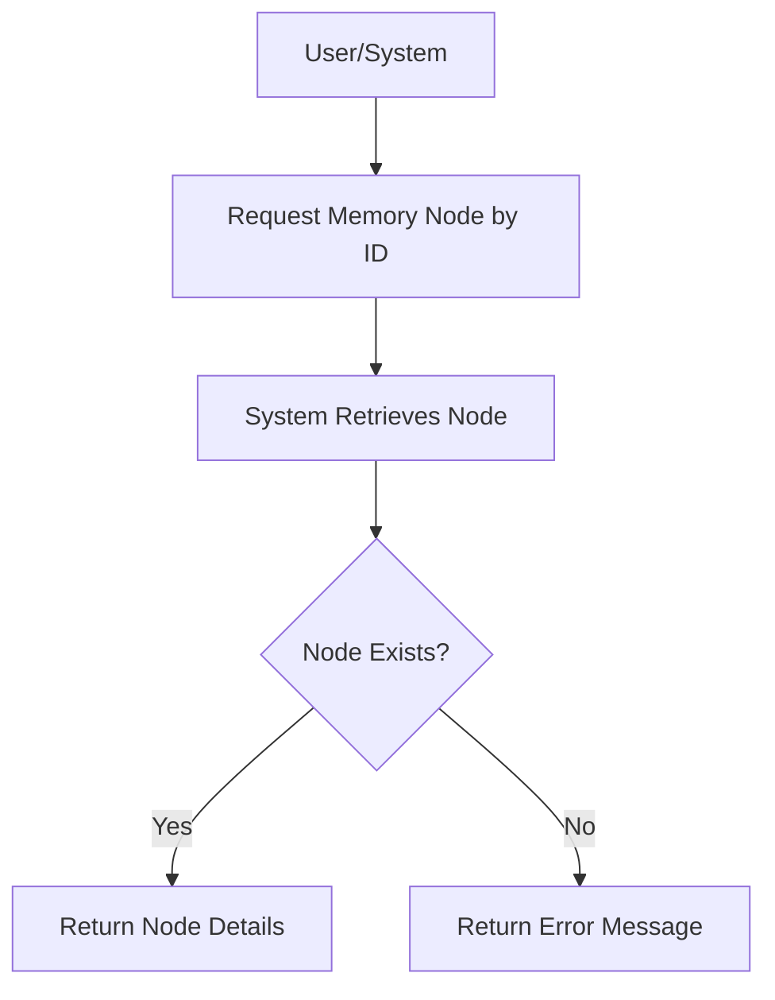

# User Story: /memory/nodes/{id}

## Motivation
To allow users and systems to retrieve detailed information about a specific memory node in the knowledge base, supporting data exploration, debugging, and automation.

## Actors
- End users
- Developers
- AI assistants

## Preconditions
- The memory node with the specified ID exists in the system.
- The user or system has access to the /memory/nodes/{id} endpoint.

## Step-by-Step Actions
1. User or system sends a request to /memory/nodes/{id} with the desired node ID.
2. The system retrieves the node's details from the knowledge base.
3. The system returns the node's information, including attributes and relationships.

## Expected Outcomes
- The requester receives detailed information about the specified memory node.
- The data can be used for further analysis, visualization, or automation.

## Best Practices
- Validate the node ID before querying.
- Return clear error messages if the node does not exist.
- Include all relevant attributes and relationships in the response.
- Log access for auditing and debugging.

## Workflow Diagram

