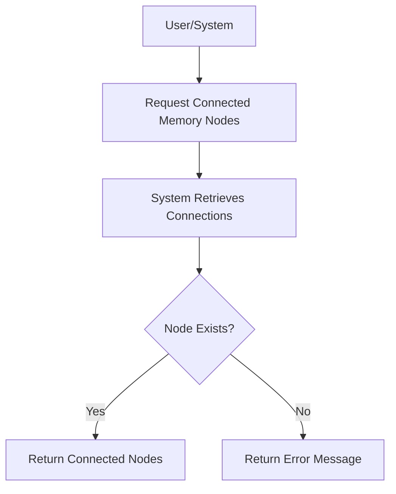

# User Story: /memory/nodes/{id}/connected

## Motivation
To enable users and systems to explore the relationships of a specific memory node by retrieving all nodes directly connected to it in the knowledge base.

## Actors
- End users
- Developers
- AI assistants

## Preconditions
- The memory node with the specified ID exists in the system.
- The user or system has access to the /memory/nodes/{id}/connected endpoint.

## Step-by-Step Actions
1. User or system sends a request to /memory/nodes/{id}/connected.
2. The system retrieves all nodes directly connected to the specified node.
3. The system returns a list of connected nodes and their relationship types.

## Expected Outcomes
- The requester receives a list of nodes connected to the specified memory node.
- The data can be used for visualization, analysis, or further queries.

## Best Practices
- Validate the node ID before querying.
- Return clear error messages if the node does not exist.
- Include relationship types in the response for context.
- Paginate results for nodes with many connections.

## Workflow Diagram

