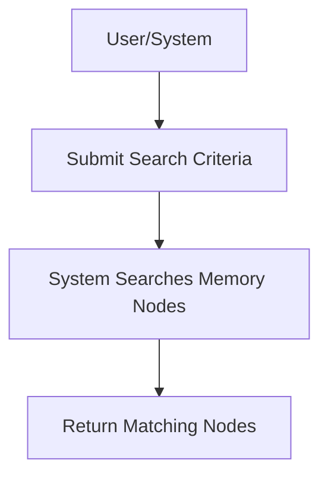

# User Story: /memory/nodes/search

## Motivation
To enable users and systems to search for memory nodes in the knowledge base based on specific criteria, supporting targeted exploration and automation.

## Actors
- End users
- Developers
- AI assistants

## Preconditions
- The knowledge base contains searchable memory nodes.
- The user or system has access to the /memory/nodes/search endpoint.

## Step-by-Step Actions
1. User or system sends a search request to /memory/nodes/search with criteria.
2. The system searches the knowledge base for matching nodes.
3. The system returns a list of nodes that match the criteria.

## Expected Outcomes
- The requester receives a list of memory nodes matching the search criteria.
- The data can be used for targeted analysis or further queries.

## Best Practices
- Support advanced search operators and filters.
- Paginate results for large result sets.
- Log search queries for auditing and optimization.

## Workflow Diagram

