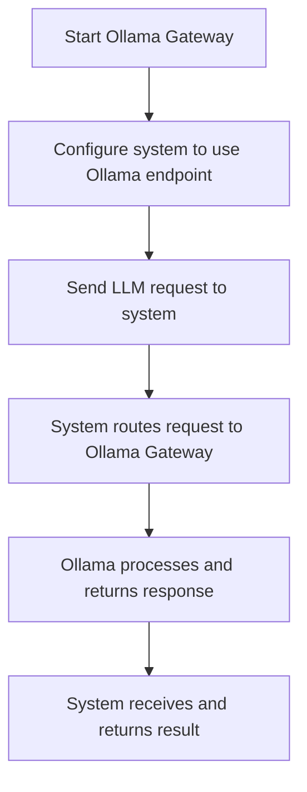

# User Story: Ollama Gateway Support

## Motivation
As a developer or system integrator, I want to add support for the Ollama Gateway so that the system can route LLM requests through Ollama, enabling flexible model selection and local inference.

## Actors
- Developer
- System Integrator
- System Administrator

## Preconditions
- Ollama Gateway is installed and running (locally or in Docker).
- The system is configured to recognize and route requests to the Ollama Gateway.
- Required environment variables and configuration files are set up.

## Step-by-Step Actions
1. Install and start the Ollama Gateway service.
2. Update environment variables to point to the Ollama Gateway endpoint.
3. Configure the system to use Ollama as a model provider (e.g., via Makefile or config files).
4. Test the integration by sending a sample LLM request through the gateway.
5. Monitor logs and verify that requests are routed and responses are received as expected.

## Expected Outcomes
- The system can successfully route LLM requests through the Ollama Gateway.
- Developers can select and use different models via Ollama.
- Local inference is possible, reducing reliance on external APIs.

## Best Practices
- Use environment variables for endpoint configuration to allow easy switching between providers.
- Monitor gateway logs for errors or performance issues.
- Document supported models and configuration steps for onboarding.
- Use Docker Compose for consistent environment setup.

## Workflow Diagram



---

## References
- `Makefile.ai` targets: `ai-ollama-pull-model`, `ai-ollama-serve-docker-gateway-bg`, `ai-up-ollama-functions`, `ai-ollama-functions-health`, `ai-ollama-functions-logs`
- `docker-compose.yml` for service definitions
- [llm_onboarding.md](llm_onboarding.md) for LLM integration details

---

## Troubleshooting & Additional Makefile Targets

### Common Issues & Solutions

- **Ollama gateway health check fails**
  - Ensure both the backend and gateway are running:
    ```bash
    make -f Makefile.ai ai-ollama-serve-docker-gateway-bg
    make -f Makefile.ai ai-up-ollama-functions
    make -f Makefile.ai ai-ollama-functions-health
    ```
- **Model not found or outdated**
  - Pull or update the model:
    ```bash
    make -f Makefile.ai ai-ollama-pull-model
    ```
- **Gateway or backend not responding**
  - Restart the services:
    ```bash
    make -f Makefile.ai ai-restart-ollama-functions
    make -f Makefile.ai ai-ollama-restart-docker-gateway
    ```
- **Stop or remove the gateway service**
  - Stop or remove the container:
    ```bash
    make -f Makefile.ai ai-stop-ollama-functions
    make -f Makefile.ai ai-down-ollama-functions
    ```
- **Kill or restart the Ollama backend (host)**
  - Kill or restart the backend process:
    ```bash
    make -f Makefile.ai ai-ollama-kill
    make -f Makefile.ai ai-ollama-restart-docker-gateway
    ```
- **View logs for debugging**
  - Gateway logs:
    ```bash
    make -f Makefile.ai ai-ollama-functions-logs
    ```
  - Ollama backend logs (if running in background):
    ```bash
    make -f Makefile.ai ai-ollama-logs
    ```

### Reference: Makefile Targets for Ollama Functions
- `ai-ollama-pull-model` — Download/update the Ollama model
- `ai-ollama-serve-docker-gateway` — Start backend in foreground
- `ai-ollama-serve-docker-gateway-bg` — Start backend in background
- `ai-ollama-kill` — Kill all running Ollama backend processes
- `ai-ollama-restart-docker-gateway` — Restart backend on Docker gateway
- `ai-up-ollama-functions` — Start the gateway service (Docker Compose)
- `ai-restart-ollama-functions` — Rebuild and restart the gateway service
- `ai-stop-ollama-functions` — Stop the gateway service
- `ai-down-ollama-functions` — Remove the gateway service container
- `ai-ollama-functions-health` — Health check for the gateway
- `ai-ollama-functions-logs` — View gateway logs
- `ai-ollama-logs` — View Ollama backend logs (background run) 