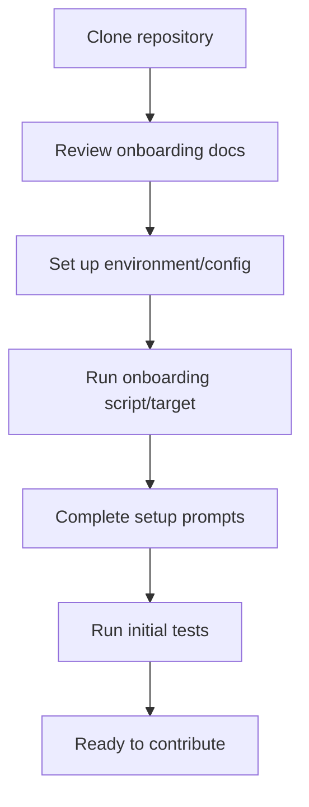

# User Story: onboard

## Motivation
Onboarding new developers and contributors efficiently is critical for project velocity and team cohesion. The onboard workflow ensures that all prerequisites are met, the environment is set up, and the user is ready to contribute.

## Actors
- New Developers: Follow onboarding steps to get started.
- Project Maintainers: Maintain and update onboarding documentation.
- Automation Systems: Validate onboarding steps and environment setup.

## Preconditions
- Access to the project repository.
- Required tools (Docker, Docker Compose, Python, etc.) are installed.
- Onboarding documentation is up to date.

## Step-by-Step Actions
1. Clone the project repository.
2. Review the onboarding documentation (`ONBOARDING.md` or equivalent).
3. Set up environment variables and configuration files as instructed.
4. Run the onboarding script or Makefile target:
   ```bash
   make onboard
   ```
5. Follow prompts to complete environment setup and verification.
6. Run initial tests to confirm setup.

### Workflow Diagram


## Expected Outcomes
- Developer environment is set up and verified.
- All prerequisites are installed and configured.
- New contributors are ready to begin development.

## Best Practices
- Keep onboarding documentation up to date with project changes.
- Automate as much of the setup as possible.
- Validate environment setup with initial test runs.
- Save onboarding output for further analysis:
  ```bash
  make onboard > onboard_output.txt
  ```

## Troubleshooting
- **Missing dependencies:** Ensure all required tools are installed and available in PATH.
- **Environment variable errors:** Double-check configuration files and variable names.
- **Setup script failures:** Review the output for error messages and follow suggested fixes.
- **Test failures after onboarding:** Confirm that all services are running and configuration matches the documentation.
