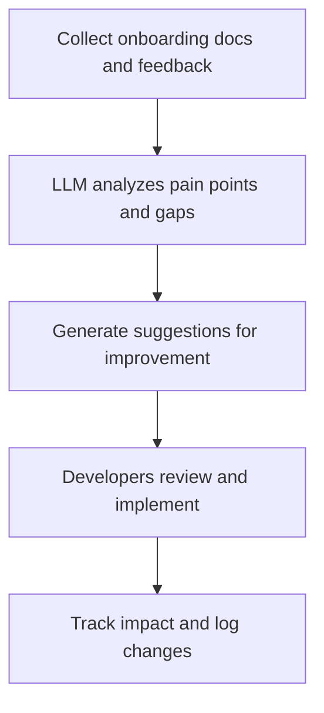

# User Story: Onboarding Path Optimizer

## Motivation
To continuously improve the onboarding experience for new developers and users, the system should analyze onboarding documentation and feedback, and suggest optimizations or new paths. This ensures onboarding remains effective, up to date, and tailored to user needs.

## Actors
- Automation system (runs the onboarding optimizer)
- LLM (analyzes docs and feedback)
- Developers (review and implement suggestions)

## Preconditions
- Onboarding documentation and user feedback are available and accessible.
- LLM integration is available for analysis and suggestion generation.

## Step-by-Step Actions
1. The worker collects onboarding documentation and user feedback.
2. It uses the LLM to analyze:
   - Common pain points or confusing steps
   - Gaps in documentation or missing onboarding paths
   - Opportunities for streamlining or clarifying instructions
3. The worker generates suggestions for improvements or new onboarding paths.
4. Developers review and implement accepted suggestions.

### Workflow Diagram


## Expected Outcomes
- Onboarding documentation is regularly improved based on real feedback and analysis.
- New users have a smoother, more effective onboarding experience.

## Best Practices
- Track which suggestions are accepted and their impact on onboarding success.
- Schedule regular analysis runs and allow for manual triggering.
- Log all suggestions and provide clear rationales for each.
- Encourage feedback from new users to fuel continuous improvement.
- Save optimizer logs for further analysis:
  ```bash
  make -f Makefile.ai-memory onboarding-path-optimizer > onboarding_optimizer_output.txt
  ```

## Troubleshooting
- **LLM errors or timeouts:** Check system logs and LLM service health.
- **Suggestions not relevant:** Review feedback sources and refine analysis criteria.
- **Worker not running:** Ensure the automation system is scheduled and has access to onboarding docs and feedback.
- **Impact not tracked:** Implement metrics to measure onboarding improvements. 