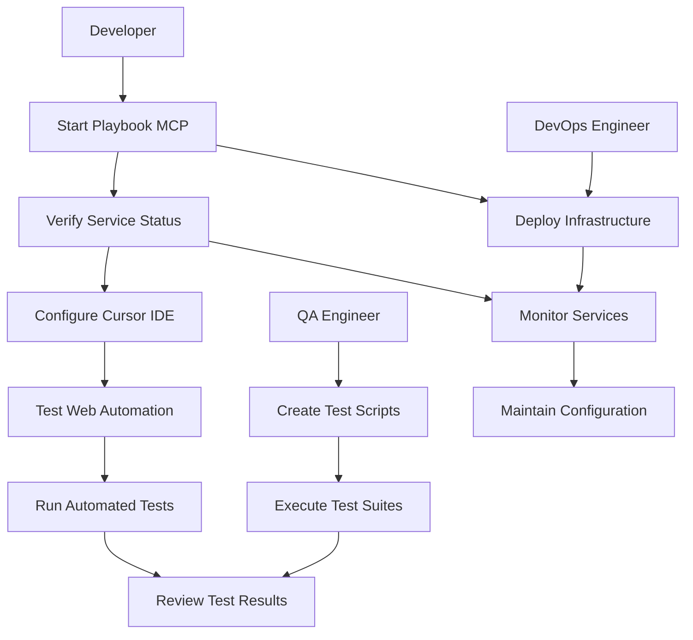

# Setting Up Playbook MCP for Web Testing

## Motivation
The AI-IDE system needs automated web testing capabilities through the Model Context Protocol (MCP). Playbook provides a powerful MCP server for web automation and testing, allowing AI agents to interact with web applications programmatically.

## Actors
- **Developer**: Wants to test web interfaces and automate browser interactions
- **QA Engineer**: Needs to create and run automated test suites
- **DevOps Engineer**: Manages the Docker infrastructure and service deployment

## Preconditions
- Docker and Docker Compose are installed and running
- The AI-IDE project is set up with the existing MCP infrastructure
- Cursor IDE is configured for MCP integration

## Step-by-Step Actions

### 1. Start the Playbook MCP Server
```bash
# Start the development environment with Playbook MCP
make -f Makefile.ai playbook-up

# Or start all services including Playbook
make -f Makefile.ai up-full
```

### 2. Verify Playbook MCP is Running
```bash
# Check service status
make -f Makefile.ai playbook-status

# Test connection
make -f Makefile.ai playbook-test

# View logs if needed
make -f Makefile.ai playbook-logs
```

### 3. Configure Cursor IDE for Playbook MCP
The `.cursor/mcp.json` file is automatically configured to connect to the Playbook MCP server:

```json
{
  "mcpServers": {
    "playbook": {
      "command": "docker",
      "args": ["compose", "exec", "-T", "playbook-mcp", "npx", "-y", "@playbook-ai/playbook-mcp"],
      "env": {
        "PLAYBOOK_API_KEY": "${PLAYBOOK_API_KEY}"
      }
    }
  }
}
```

### 4. Test Web Automation
Once connected, you can use Playbook MCP tools in Cursor:

```javascript
// Example: Navigate to a website and take a screenshot
await mcp_playbook_navigate({
  url: "http://localhost:3000"
});

await mcp_playbook_screenshot({
  path: "/tmp/screenshot.png"
});

// Example: Fill out a form
await mcp_playbook_fill({
  selector: "#email",
  value: "test@example.com"
});

await mcp_playbook_click({
  selector: "#submit-button"
});
```

### 5. Run Tests in Test Environment
```bash
# Start test environment with Playbook MCP
docker-compose -f docker-compose.test.yml --profile test up -d test-playbook-mcp

# Run Playwright tests with Playbook MCP support
make -f Makefile.ai test-test
```

## Expected Outcomes
- Playbook MCP server is running on port 3002 (dev) and 3003 (test)
- Cursor IDE can access Playbook MCP tools for web automation
- Web testing can be automated through MCP protocol
- Integration with existing Playwright test infrastructure

## Best Practices
- Always use the Makefile targets for service management
- Check service status before running tests
- Use the test environment for automated testing
- Monitor logs for any connection issues
- Keep the Playbook API key secure if using advanced features

## Troubleshooting

### Service Won't Start
```bash
# Check Docker logs
make -f Makefile.ai playbook-logs

# Restart the service
make -f Makefile.ai playbook-restart
```

### Connection Issues
```bash
# Verify ports are available
netstat -an | grep 3002
netstat -an | grep 3003

# Test direct connection
curl http://localhost:3002/health
```

### MCP Integration Problems
- Restart Cursor IDE after configuration changes
- Verify the `.cursor/mcp.json` file is properly formatted
- Check that the Docker container is running and accessible

## References
- [Playbook MCP Documentation](https://github.com/playbook-ai/playbook-mcp)
- [Model Context Protocol](https://docs.anthropic.com/claude/docs/model-context-protocol)
- [Docker Compose Documentation](https://docs.docker.com/compose/)

