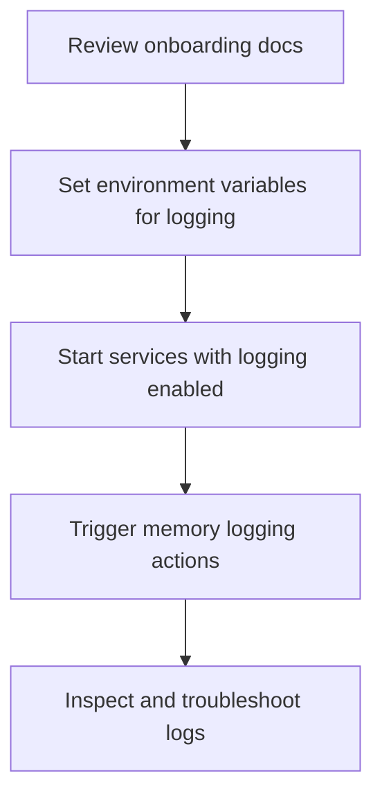

# User Story: Portable Memory Logging Onboarding

## Motivation
As a developer or new team member, I want clear onboarding for the portable memory logging system so I can understand how to enable, use, and troubleshoot memory logging features across different environments.

## Actors
- Developer
- New Team Member
- System Administrator

## Preconditions
- The codebase includes portable memory logging features.
- Required environment variables and config files are available.
- Access to the relevant Docker containers or services.

## Step-by-Step Actions
1. **Copy or symlink the following into your repo:**
   - `scripts/create_memory.py`, `scripts/summarize_git_diff.py`, and any helper scripts
   - The relevant Makefile targets (see `Makefile.memory` or copy from a reference repo)
2. **Set environment variables as needed:**
   - `PROJECT` (defaults to repo name)
   - `NAMESPACE` (defaults to project)
   - `MEMORY_API_URL` (defaults to `http://localhost:9103/memory/nodes`)
   - `LLM_API_URL` (defaults to `http://localhost:9103/summarize-git-diff`)
   - `DIFFS_DIR` (defaults to `diffs`)
   - Use a `.env` file or export in your shell for convenience
3. **Start or connect to the required services:**
   - Memory API and LLM Summarization API (Ollama Functions)
   - Use Docker Compose or point to a shared instance
4. **Run the workflow:**
   ```bash
   make -f Makefile.memory ai-memory-log-git-diff
   ```
   - This will generate a git diff, summarize it with the LLM, and store the summary and a reference to the diff file as a memory node
5. Inspect logs for expected entries and troubleshoot if needed.

> **Quick Start Example (optional):**
> ```bash
> # Clone or copy scripts and Makefile.memory
> cp -r ../ai-ide-api/scripts ./scripts
> cp ../ai-ide-api/Makefile.memory ./Makefile.memory
>
> # (Optional) Set environment variables
> export PROJECT=my-other-repo
> export MEMORY_API_URL=http://shared-server:9103/memory/nodes
>
> # Log a git diff as a memory node
> make -f Makefile.memory ai-memory-log-git-diff
> ```

## Expected Outcomes
- Team members can enable and use portable memory logging in any environment.
- Logs are generated as expected and can be used for debugging or auditing.
- Onboarding is smooth and reproducible.

## Best Practices
- Use environment variables for all project-specific values
- Namespace memory nodes by project for easy filtering
- Store only references to large diffs, not the full content
- Document the workflow in your project's README for discoverability
- Use `.env` files for local overrides
- Reference this user story in onboarding docs and code reviews
- Use consistent log formats across environments.
- Regularly review logs for anomalies or errors.
- Provide troubleshooting tips in onboarding docs.

## Workflow Diagram



## References
- See the project `README.md` for a copy-paste quick start
- For advanced usage, see the Makefile and scripts for all available targets and options
- For troubleshooting, check the logs of the Memory API and LLM Summarization API

---

A collection of narrative styles you can use for onboarding, documentation, and team workflows.

1. **Space Exploration (Starship Crew)**  
   Boldly code where no one has coded before. Starship missions, AI copilots, and cosmic discoveries.

2. **Medieval Quest (Knights & Wizards)**  
   Quests, dragons, enchanted artifacts, and guilds. Code as a knight, mage, or royal advisor.

3. **Detective Agency (Noir or Modern)**  
   Sleuthing, mysteries, secret files, and code 'cases.' Solve bugs as a lead detective.

4. **Superhero League**  
   Secret lairs, superpowers, villains (bugs), and sidekicks. Assemble your league to save the codebase.

5. **Ancient Mythology (Greek, Norse, etc.)**  
   Gods, titans, epic journeys, and enchanted tools. Answer the call of the Fates.

6. **Secret Agents / Spy Thriller**  
   Espionage, gadgets, secret missions, and encrypted messages. Crack the case as an elite agent.

7. **Fantasy Adventure (D&D, Tolkien)**  
   Adventuring parties, magical realms, monsters, and loot. Gather your party and venture forth.

8. **Steampunk Inventors**  
   Gears, steam engines, inventions, and airships. Tinker and invent in a world of brass and steam.

9. **Sports Team**  
   Training, matches, championships, and team spirit. Suit up and score big in the code league.

10. **Wilderness Expedition (Explorers)**  
    Maps, uncharted lands, survival, and discoveries. Chart a course through the Jungle of JIRA.

11. **Cyberpunk Spy Thriller**  
    Neon-lit cityscapes, hackers, rogue AIs, and secret missions in the digital underworld. Infiltrate the CodeGrid and outsmart rival syndicates.

---

Feel free to add, remix, or expand on these themes as your team's story evolves! 