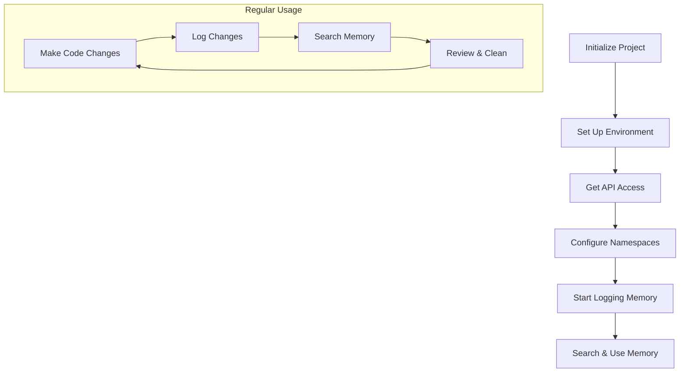

# User Story: Portable Memory System Setup for External Projects

## Motivation
As a developer working on external projects, I want to leverage the AI IDE's memory system to track, analyze, and search across my codebase while maintaining a connection to a centralized knowledge base. This enables better code understanding, documentation, and knowledge sharing across different repositories.

## Actors
- Junior Developers
- External Project Teams
- Project Maintainers
- CI/CD Systems

## Preconditions
- Access to the AI IDE API
- Git repository for your project
- Basic understanding of Make and environment variables

## Step-by-Step Guide

### 1. Initial Setup 🚀

First, we'll set up the basic structure in your project:

```bash
# Create necessary directories
mkdir -p scripts diffs

# Copy required scripts from the AI IDE repository
# Replace /path/to/ai-ide with the actual path
cp /path/to/ai-ide/scripts/create_memory.py scripts/
cp /path/to/ai-ide/scripts/summarize_git_diff.py scripts/
cp /path/to/ai-ide/scripts/memory_utils.py scripts/
```

### 2. Create Your Makefile 📝

Create a new file called `Makefile.memory` in your project root:

```makefile
# Makefile.memory

# Default values for environment variables
PROJECT ?= $(shell basename $(PWD))
NAMESPACE ?= $(PROJECT)
MEMORY_API_URL ?= http://localhost:9103/memory/nodes
LLM_API_URL ?= http://localhost:9103/summarize-git-diff
DIFFS_DIR ?= diffs

# Memory logging targets
.PHONY: ai-memory-log-git-diff
ai-memory-log-git-diff:
	@mkdir -p $(DIFFS_DIR)
	python scripts/create_memory.py

# Search memory nodes
.PHONY: ai-memory-search
ai-memory-search:
	@echo "Searching memory nodes..."
	@curl -X POST "$(MEMORY_API_URL)/search" \
		-H "Content-Type: application/json" \
		-d '{"text": "$(QUERY)", "namespace": "$(NAMESPACE)", "limit": 5}'
```

### 3. Set Up Environment Variables 🔧

Create a `.env` file in your project root:

```bash
# .env
PROJECT=your-project-name
NAMESPACE=your-project-namespace
MEMORY_API_URL=http://localhost:9103/memory/nodes
LLM_API_URL=http://localhost:9103/summarize-git-diff
DIFFS_DIR=diffs
```

### 4. Get API Access 🔑

Run this command to get your API token:

```bash
curl -X POST http://localhost:9103/onboarding/init \
  -H "Content-Type: application/json" \
  -d '{
    "project_name": "your-project-name",
    "path": "external_project"
  }'

# Save the API token from the response!
```

Add the token to your `.env` file:
```bash
# .env (append this)
API_TOKEN=your-token-here
```

### 5. Test Your Setup ✅

Try these commands to verify everything works:

```bash
# Log your first git diff
make -f Makefile.memory ai-memory-log-git-diff

# Search memory nodes (replace "your query" with actual search terms)
QUERY="your query" make -f Makefile.memory ai-memory-search
```

## Understanding Namespaces 🗂️

The memory system uses two types of namespaces:

1. **Project Namespace** (`your-project-name/private`)
   - For security and access control
   - Set when you initialize your project
   - Isolates your data from other projects

2. **Memory Namespace** (e.g., `code`, `docs`, `research`)
   - For organizing different types of content
   - Can create as many as needed
   - Used when storing or searching memories

## Best Practices 💡

1. **Regular Logging**
   - Log after significant code changes
   - Log before and after major refactoring
   - Set up automated logging in CI/CD

2. **Namespace Organization**
   - Use descriptive namespace names
   - Keep related content in the same namespace
   - Document your namespace structure

3. **Memory Hygiene**
   - Regularly review logged memories
   - Clean up outdated information
   - Update metadata and tags

4. **CI/CD Integration**
   Add this to your CI pipeline:
   ```yaml
   memory-logging:
     script:
       - make -f Makefile.memory ai-memory-log-git-diff
   ```

## Troubleshooting Guide 🔍

### Common Issues and Solutions

1. **API Connection Failed**
   - Check if the API URL is correct
   - Verify your API token
   - Ensure the API server is running

2. **Script Errors**
   - Check Python dependencies
   - Verify script permissions
   - Look for error messages in logs

3. **Memory Not Found**
   - Verify namespace spelling
   - Check if memory was logged
   - Confirm search query format

### Getting Help

If you're stuck:
1. Check the logs
2. Review the API documentation
3. Contact your project's memory system admin

## Expected Outcomes

After setting up the portable memory system, you should be able to:
- Log code changes automatically
- Search across your project's memory
- Share knowledge with your team
- Track development progress
- Maintain a clean, organized knowledge base

## Workflow Diagram



## Quick Reference

```bash
# Log git diff
make -f Makefile.memory ai-memory-log-git-diff

# Search memory (replace query)
QUERY="search terms" make -f Makefile.memory ai-memory-search

# View namespaces
curl -H "Authorization: Bearer $API_TOKEN" \
  "$MEMORY_API_URL/namespaces"
```

## Next Steps
1. Set up automated logging
2. Create custom search queries
3. Integrate with your development workflow
4. Document your namespace structure

---

**Remember:** The memory system is a tool to help you work smarter, not harder. Start simple and expand your usage as you get comfortable with the basics.

Need help? Check the [main documentation](docs/MEMORY_SYSTEM.md) or contact your system administrator. 