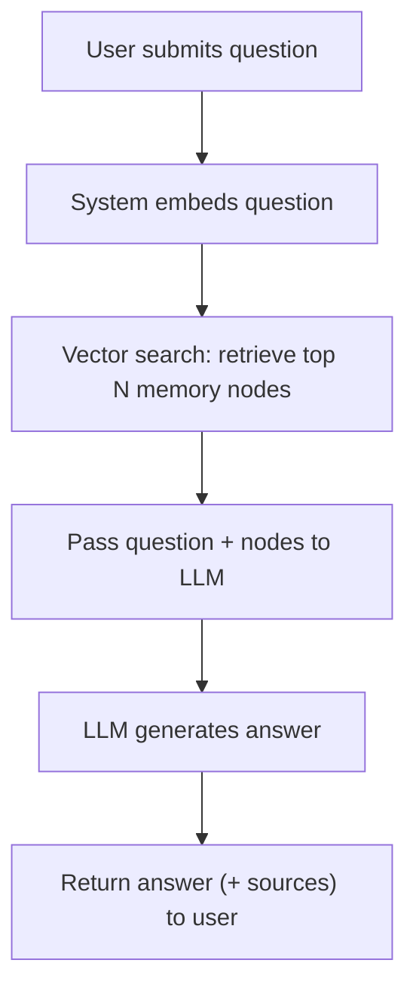

# User Story: RAG-Enabled Memory Search and Answering

## Motivation
Enable users to ask natural language questions and receive answers generated by an LLM, grounded in relevant memory nodes retrieved from the vector database.

## Actors
- End users (with questions)
- AI assistants/LLMs
- Developers

## Preconditions
- Memory nodes are stored with vector embeddings in the database.
- An LLM is available for answer generation.
- A vector search API endpoint exists (e.g., `/memory/nodes/search`).
- The system can pass retrieved memory content to the LLM.

## Step-by-Step Actions
1. **User submits a question** via UI or API.
2. **System embeds the question** using the same embedding model as the memory nodes.
3. **System performs a vector search** to retrieve the top N most relevant memory nodes.
4. **System passes the retrieved nodes and the original question to the LLM**.
5. **LLM generates an answer** using both the user's question and the retrieved context.
6. **System returns the answer** (and optionally, the supporting memory nodes) to the user.

## Expected Outcomes
- The user receives a relevant, context-grounded answer to their question.
- The answer is traceable to specific memory nodes (for transparency/explainability).

## Best Practices
- Limit the number of retrieved nodes to avoid context window overflow.
- Filter or rank nodes by recency, relevance, or namespace as needed.
- Log queries and results for auditing and improvement.
- Allow users to see which memory nodes were used to generate the answer.

## Example Workflow Diagram



## What Needs to be Added to Support RAG?

1. **API Endpoint for RAG Search**
   - New endpoint: `/memory/rag_search` or `/memory/ask`
   - Accepts a question, optional filters (namespace, tags), and returns an LLM-generated answer + sources.

2. **LLM Integration**
   - Service or function to call the LLM with both the user's question and the retrieved memory nodes.

3. **Vector Search Logic**
   - Use existing vector search to retrieve relevant nodes.
   - Optionally, hybrid search (vector + keyword/metadata).

4. **Result Formatting**
   - Return the answer and the supporting memory nodes (for transparency).

5. **UI/UX (Optional)**
   - Interface for users to ask questions and view answers with sources.

---

## How to Test

1. **Start all required services:**
   ```bash
   make -f Makefile.ai-dev dev-up
   ```
2. **Ensure you have a valid API token** (e.g., in `.api_admin_token`).
3. **Add some memory nodes** (if needed) using `/memory/nodes`.
4. **Send a RAG search request:**
   ```bash
   curl -X POST http://localhost:9103/memory/rag_search \
     -H "Authorization: Bearer $(cat .api_admin_token)" \
     -H "Content-Type: application/json" \
     -d '{
       "question": "How do I run tests in this project?",
       "namespace": "default",
       "top_k": 5
     }' | jq .
   ```
5. **Expected response:**
   - `answer`: The LLM-generated answer.
   - `sources`: Array of memory nodes used as context, each with:
     - `id`, `content`, `namespace`, `meta`, `created_at`, `confidence`

6. **Troubleshooting:**
   - If you get an error about LLM access, check your token and project settings.
   - If the answer is "No relevant memory nodes found.", try adding more memory nodes or adjusting your query.
   - Check the API and Ollama logs for errors if the LLM call fails.

## Sample Response

A successful RAG search will return a JSON object like this:

```json
{
  "answer": "To run tests in this project, you should use the command `make -f Makefile.ai ai-test`.",
  "sources": [
    {
      "id": "05b0fabd-e607-4192-8e43-d9c1dd9e9527",
      "content": "To run tests, use make -f Makefile.ai ai-test.",
      "namespace": "default",
      "meta": "test instructions",
      "created_at": "2025-06-17T22:07:48.019711",
      "confidence": 0.95
    }
  ]
}
```

- `answer`: The LLM-generated answer, grounded in your memory nodes.
- `sources`: The memory nodes used as context, including their confidence scores.

## Searching Within a Namespace

You can search for relevant memories within a specific namespace (such as `progress_reports`) using the `/memory/nodes/search` endpoint. This is useful for finding summaries, reports, or any other memory nodes related to a particular topic or workflow.

**Example: Search Progress Reports by Text Query**

```bash
curl -X POST http://localhost:9103/memory/nodes/search \
  -H "Authorization: Bearer $(cat .api_admin_token)" \
  -H "Content-Type: application/json" \
  -d '{
    "query": "gitignore",
    "namespace": "progress_reports",
    "limit": 5
  }' | jq .
```

- Replace `"gitignore"` with any keyword or phrase you want to search for.
- Adjust `"limit"` as needed.

The system will embed your query and perform a vector search for the most relevant memory nodes in the specified namespace. The response will include the most similar summaries or entries. 