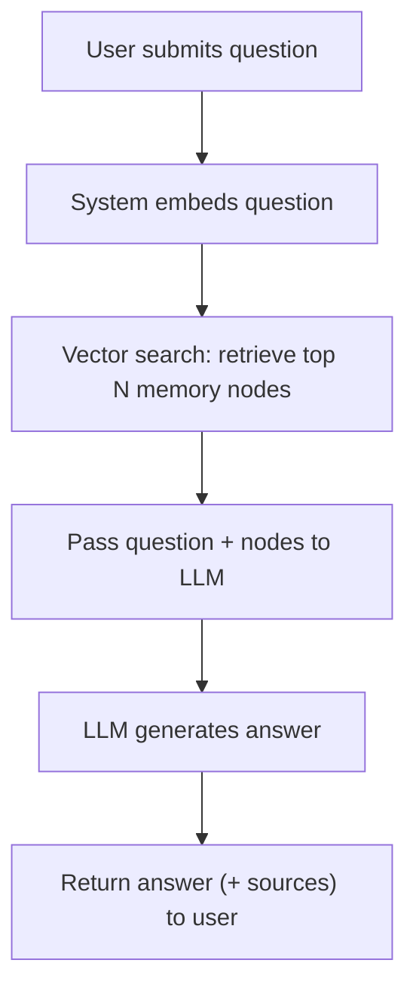

# User Story: RAG-Enabled Memory Search and Answering

## Motivation
Enable users to ask natural language questions and receive answers generated by an LLM, grounded in relevant memory nodes retrieved from the vector database.

## Actors
- End users (with questions)
- AI assistants/LLMs
- Developers

## Preconditions
- Memory nodes are stored with vector embeddings in the database.
- An LLM is available for answer generation.
- A vector search API endpoint exists (e.g., `/memory/nodes/search`).
- The system can pass retrieved memory content to the LLM.

## Step-by-Step Actions
1. **User submits a question** via UI or API.
2. **System embeds the question** using the same embedding model as the memory nodes.
3. **System performs a vector search** to retrieve the top N most relevant memory nodes.
4. **System passes the retrieved nodes and the original question to the LLM**.
5. **LLM generates an answer** using both the user's question and the retrieved context.
6. **System returns the answer** (and optionally, the supporting memory nodes) to the user.

## Expected Outcomes
- The user receives a relevant, context-grounded answer to their question.
- The answer is traceable to specific memory nodes (for transparency/explainability).

## Best Practices
- Limit the number of retrieved nodes to avoid context window overflow.
- Filter or rank nodes by recency, relevance, or namespace as needed.
- Log queries and results for auditing and improvement.
- Allow users to see which memory nodes were used to generate the answer.

## Example Workflow Diagram

## What Needs to be Added to Support RAG?

1. **API Endpoint for RAG Search**
   - New endpoint: `/memory/rag_search` or `/memory/ask`
   - Accepts a question, optional filters (namespace, tags), and returns an LLM-generated answer + sources.

2. **LLM Integration**
   - Service or function to call the LLM with both the user's question and the retrieved memory nodes.

3. **Vector Search Logic**
   - Use existing vector search to retrieve relevant nodes.
   - Optionally, hybrid search (vector + keyword/metadata).

4. **Result Formatting**
   - Return the answer and the supporting memory nodes (for transparency).

5. **UI/UX (Optional)**
   - Interface for users to ask questions and view answers with sources. 