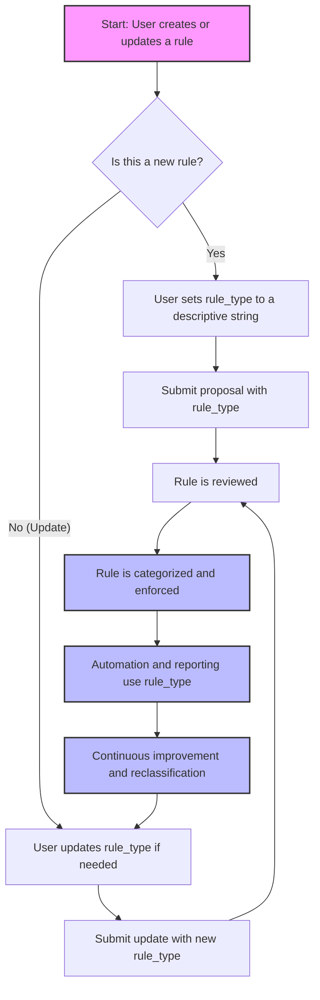

# User Story: Understanding and Using `rule_type` in Rule Proposals

## Motivation
To ensure rules are organized, discoverable, and actionable, every rule in the system must have a `rule_type`—a string identifier that describes the category or nature of the rule. Allowing users to update `rule_type` enables flexibility as best practices evolve or as rules are reclassified.

---

## Actors
- **Rule Authors:** Developers, reviewers, or AI agents proposing or editing rules.
- **Rule Reviewers:** Team members or admins who review, approve, or update rules.
- **System Integrators:** Tools or scripts that generate or process rules.

---

## Preconditions
- The user is creating or updating a rule via the API, UI, or automation.
- The rule must have a `rule_type` string.

---

## Step-by-Step Actions

1. **Proposing a New Rule**
   - The user (or tool) sets `rule_type` to a descriptive string, e.g., `"no_eval"`, `"bare_except"`, `"formatting"`, `"naming_convention"`.
   - The proposal is submitted with this `rule_type`.

2. **Updating an Existing Rule**
   - The user may update `rule_type` if the rule's category changes (e.g., from `"formatting"` to `"linting"`), or to correct a misclassification.
   - The system validates that `rule_type` is a non-empty string.

3. **Review and Enforcement**
   - Reviewers and automated systems use `rule_type` to filter, group, and enforce rules.
   - Consistent use of `rule_type` improves searchability and reporting.

---

## Workflow Diagram

Below is a Mermaid diagram illustrating the workflow for creating or updating a rule's `rule_type`:

---

## Expected Outcomes

- Rules are consistently categorized, making them easier to manage and enforce.
- Users can correct or refine rule categories as the codebase and best practices evolve.
- Automation and reporting tools can leverage `rule_type` for analytics and enforcement.

---

## Best Practices

- **Be Descriptive:** Use clear, concise strings (e.g., `"no_eval"`, `"no_print"`, `"naming_convention"`).
- **Avoid Duplicates:** Reuse existing `rule_type` values where possible to avoid fragmentation.
- **Document New Types:** When introducing a new `rule_type`, consider documenting its purpose in the rules documentation.
- **Update When Needed:** Don't hesitate to update `rule_type` if a rule's purpose or scope changes.

---

## Example Values

- `"no_eval"` — Disallow use of `eval()`
- `"bare_except"` — Disallow bare `except:` clauses
- `"formatting"` — Enforce code formatting standards
- `"naming_convention"` — Enforce variable/class naming rules
- `"sql_injection"` — Prevent unsafe SQL patterns

---

## Rationale

Allowing `rule_type` to be updated ensures the rule system remains flexible and relevant as coding standards and team practices evolve. It also empowers users to keep the rule taxonomy clean and meaningful. 