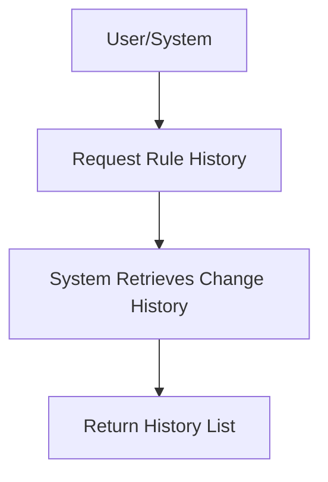

# User Story: /memory/rules/{rule_id}/history

## Motivation
To allow users and systems to view the full history of changes to a specific rule in the memory knowledge base, supporting auditing, debugging, and compliance.

## Actors
- End users
- Developers
- System administrators

## Preconditions
- The rule with the specified ID exists in the memory knowledge base.
- The user or system has access to the /memory/rules/{rule_id}/history endpoint.

## Step-by-Step Actions
1. User or system sends a request to /memory/rules/{rule_id}/history.
2. The system retrieves the full change history for the specified rule.
3. The system returns a chronological list of changes, including timestamps and authors.

## Expected Outcomes
- The requester receives a detailed history of changes to the rule.
- The data can be used for auditing, debugging, or compliance.

## Best Practices
- Include timestamps, author, and change descriptions for each entry.
- Return clear error messages if the rule does not exist.
- Log access for auditing.

## Workflow Diagram

