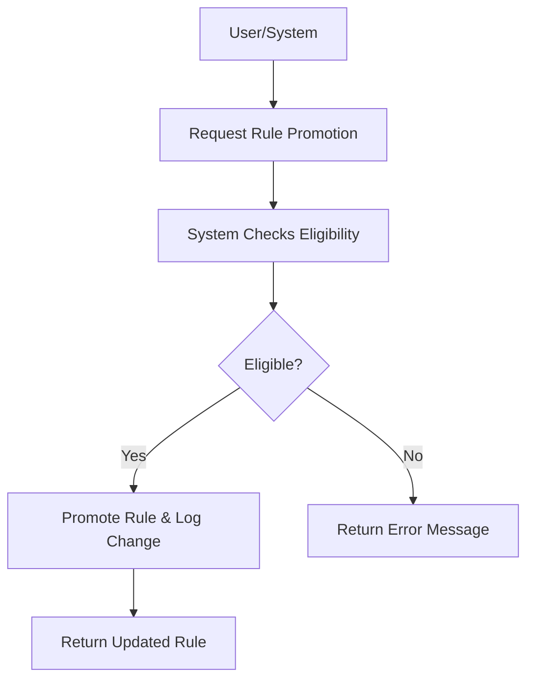

# User Story: /memory/rules/{rule_id}/promote

## Motivation
To allow users and systems to promote a specific rule in the memory knowledge base to a higher status (e.g., from draft to active), supporting workflow automation and governance.

## Actors
- End users
- Developers
- System administrators

## Preconditions
- The rule with the specified ID exists in the memory knowledge base.
- The user or system has access to the /memory/rules/{rule_id}/promote endpoint.
- The rule is eligible for promotion.

## Step-by-Step Actions
1. User or system sends a request to /memory/rules/{rule_id}/promote.
2. The system checks if the rule is eligible for promotion.
3. If eligible, the system updates the rule's status and logs the change.
4. The system returns the updated rule information.

## Expected Outcomes
- The rule is promoted to a higher status if eligible.
- The requester receives confirmation and updated rule details.
- The change is logged for auditing.

## Best Practices
- Validate eligibility before promoting a rule.
- Return clear error messages if the rule is not eligible or does not exist.
- Log all promotions for auditing and compliance.

## Workflow Diagram

