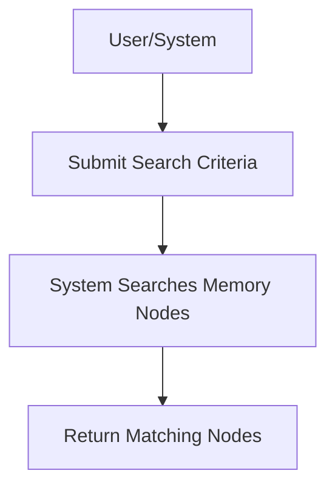

# User Story: Searching the Memory System

## Motivation
Enable users and systems to search for memory nodes in the knowledge base based on specific criteria, supporting targeted exploration, question answering, and automation.

## Actors
- End users (with questions)
- Developers
- AI assistants

## Preconditions
- The knowledge base contains searchable memory nodes.
- The user or system has access to the `/memory/nodes/search` endpoint.

## Step-by-Step Actions
1. The user or system sends a search request to `/memory/nodes/search` with their question or search criteria (e.g., keywords, text, namespace, filters).
2. The system searches the knowledge base for matching nodes using semantic and/or keyword search.
3. The system returns a list of memory nodes that match the criteria.

## Expected Outcomes
- The requester receives a list of memory nodes relevant to their question or search.
- The results can be used for further analysis, exploration, or as direct answers.

## Best Practices
- Support advanced search operators and filters (e.g., by namespace, tag, date).
- Paginate results for large result sets.
- Log search queries for auditing and optimization.
- Prefer semantic (vector) search for natural language questions.

## Example Workflow Diagram

