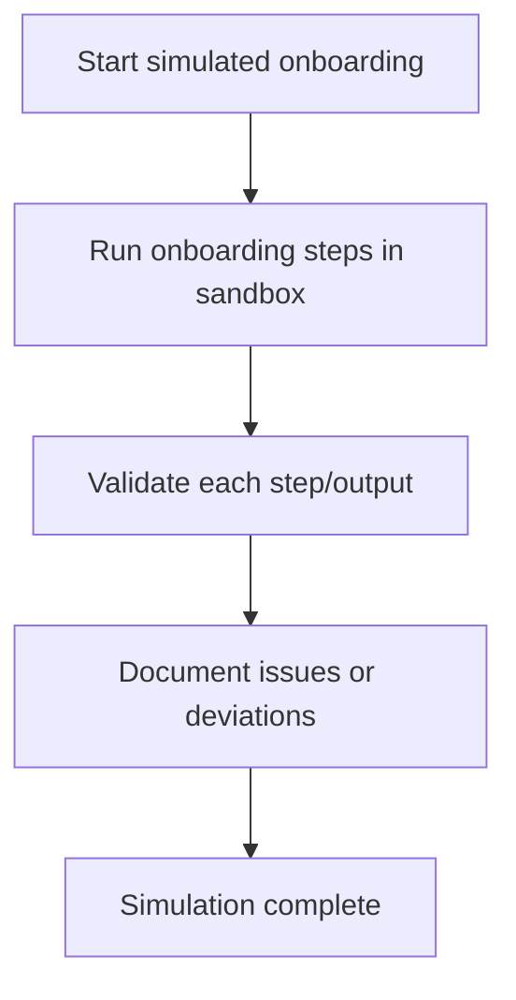

# User Story: Simulated Onboarding Demo

## Motivation
As a developer, tester, or AI agent, I want to simulate the onboarding process without affecting real projects, so I can demo, test, or validate onboarding flows safely.

---

## Step-by-Step Actions

1. **Initialize onboarding for a test project**
   - Use a project ID like `test_onboarding`.
   - Example:
     ```bash
     curl -X POST http://localhost:9103/onboarding/init \
       -H "Content-Type: application/json" \
       -d '{"project_id": "test_onboarding", "path": "external_project"}'
     ```

2. **Fetch onboarding progress**
   - See the checklist and current status:
     ```bash
     curl http://localhost:9103/onboarding/progress/test_onboarding?path=external_project | jq .
     ```

3. **(Optional) Mark a step as completed**
   - Get the `id` of a step from the progress list, then:
     ```bash
     curl -X PATCH http://localhost:9103/onboarding/progress/STEP_RECORD_ID \
       -H "Content-Type: application/json" \
       -d '{"completed": true}'
     ```

4. **Fetch onboarding/user story docs**
   - Review onboarding instructions:
     ```bash
     curl http://localhost:9103/onboarding-docs
     curl http://localhost:9103/onboarding/user_story/external_project
     ```

5. **(Optional) Clean up**
   - If you want to remove the test onboarding data, use a DB admin tool or add a cleanup endpoint/script.

---

## Python Script Example

```python
import requests

API_URL = "http://localhost:9103"
PROJECT_ID = "test_onboarding"
PATH = "external_project"

# 1. Initialize onboarding
resp = requests.post(f"{API_URL}/onboarding/init", json={"project_id": PROJECT_ID, "path": PATH})
print("Init:", resp.status_code, resp.json())

# 2. Fetch progress
resp = requests.get(f"{API_URL}/onboarding/progress/{PROJECT_ID}?path={PATH}")
print("Progress:", resp.status_code, resp.json())

# 3. (Optional) Mark first step as complete
progress = resp.json()
if progress:
    step_id = progress[0]["id"]
    resp = requests.patch(f"{API_URL}/onboarding/progress/{step_id}", json={"completed": True})
    print("Mark complete:", resp.status_code, resp.json())

# 4. Fetch onboarding docs
resp = requests.get(f"{API_URL}/onboarding-docs")
print("Onboarding docs:", resp.status_code, resp.text[:200], "...")
```

---

## Best Practices
- Use the simulated onboarding demo to test onboarding flows without affecting production data.
- Validate all steps and outputs before using the workflow in a real environment.
- Document any deviations or issues encountered during simulation.
- Save simulation output for further analysis:
  ```bash
  make simulated-onboard > simulated_onboard_output.txt
  ```

## Troubleshooting
- **Simulation errors:** Review the output for error messages and ensure all dependencies are available.
- **Unexpected results:** Compare simulation output to expected onboarding steps and outcomes.
- **Environment not isolated:** Confirm the simulation is running in a test or sandbox environment.

### Workflow Diagram


---

## References
- `/onboarding/init`