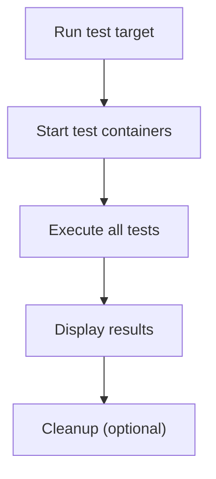

# User Story: test (Full Test Suite)

## Motivation
Running the full test suite ensures that all components of the system work as intended and that new changes do not introduce regressions. The test target standardizes this process for all contributors and CI systems.

## Actors
- Developers: Run the full test suite locally to verify changes before merging.
- CI/CD Systems: Execute the test suite automatically on every push or pull request.
- QA Engineers: Validate that the application passes all automated tests in a clean environment.

## Preconditions
- Docker and Docker Compose are installed and running.
- The test containers are built and available (if not, they will be built automatically).
- The workspace is at the project root.

## Step-by-Step Actions
1. Run the full test suite:
   ```bash
   make -f Makefile.ai-test test
   ```
   Optionally, pass extra pytest arguments:
   ```bash
   make -f Makefile.ai-test test PYTEST_ARGS="-k <pattern>"
   ```
2. The target starts the required test containers (if not already running).
3. All tests are executed in a clean, isolated Docker environment.
4. Results are displayed in the terminal, including any failures or errors.

### Workflow Diagram


## Expected Outcomes
- All tests are executed in a clean, isolated Docker environment.
- Results are displayed, including any failures or errors.
- The environment remains consistent across all contributors and CI runs.

## Best Practices
- Always nuke the test DB before running migrations and tests for a clean slate.
- Use the `test` target via `Makefile.ai-test` for running the full suite quickly.
- Use `PYTEST_ARGS` to filter or customize test runs as needed.
- Clean up with `make -f Makefile.ai-test test-down` or `ai-test-cleanup` before/after major changes.
- Document any additional test targets or workflows in user stories for discoverability.
- Save test output for further analysis:
  ```bash
  make -f Makefile.ai-test test > test_output.txt
  ```

## Troubleshooting
- **Test failures:** Review the output for stack traces and error messages.
- **Old data or schema issues:** Ensure the test DB was nuked and migrations applied.
- **Containers not starting:** Check Docker status and logs for errors.
- **Environment drift:** Use test-quickstart to reset everything to a known state.
