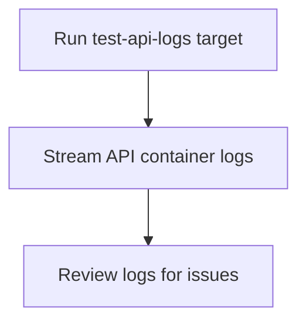

# User Story: test-api-logs

## Motivation
Accessing API container logs is essential for debugging test failures, monitoring service health, and diagnosing issues during test runs. The test-api-logs target provides a standardized way to view logs from the test API container.

## Actors
- Developers: Review API logs to debug test failures or investigate issues.
- QA Engineers: Monitor API behavior during test cycles.
- CI/CD Systems: Collect logs for analysis and reporting.

## Preconditions
- Docker and Docker Compose are installed and running.
- The test API container has been started (e.g., via test-up or test-quickstart).

## Step-by-Step Actions
1. Run the test-api-logs target:
   ```bash
   make -f Makefile.ai-test test-api-logs
   ```
2. The target streams or displays the logs from the test API container.
3. Review the logs for errors, warnings, or other relevant information.

### Workflow Diagram


## Expected Outcomes
- API logs are displayed in the terminal for review.
- Developers and QA can quickly identify and diagnose issues.
- Logs can be saved or shared for further analysis.

## Best Practices
- Use test-api-logs after test failures to investigate root causes.
- Monitor logs during long-running or complex test cycles.
- Integrate log review into your debugging workflow.
- Document common log patterns and troubleshooting tips for the team.
- Save logs to a file for further analysis:
  ```bash
  make -f Makefile.ai-test test-api-logs > api_logs.txt
  ```

## Troubleshooting
- **No logs displayed:** Ensure the test API container is running and healthy.
- **Error messages in logs:** Review for stack traces, failed requests, or service startup issues.
- **Log flooding:** Use filtering or search tools to isolate relevant log entries.
