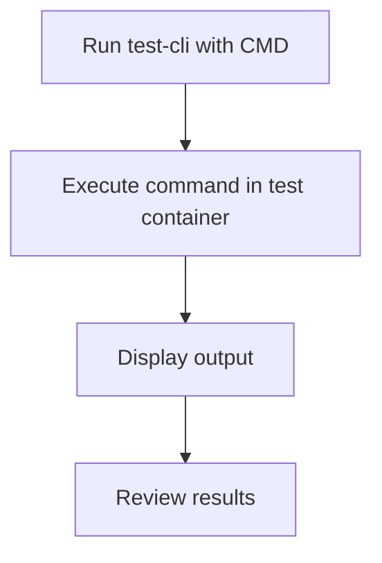

# User Story: test-cli

## Motivation
The test-cli target provides a command-line interface for running tests, allowing developers to execute specific test commands or scripts in the test environment. This is useful for debugging, running custom test scenarios, or integrating with other tools.

## Actors
- Developers: Use the CLI to run custom or ad-hoc test commands.
- QA Engineers: Execute specific test scripts for validation.

## Preconditions
- Docker and Docker Compose are installed and running.
- The workspace is at the project root.
- The test containers are up and available.

## Step-by-Step Actions
1. Run the test-cli target with the desired command:
   ```bash
   make -f Makefile.ai-test test-cli CMD="pytest tests/unit/test_example.py"
   ```
2. The target executes the specified command inside the appropriate test container.
3. Output is displayed in the terminal for review.

### Workflow Diagram


## Expected Outcomes
- The specified test command is executed in the correct environment.
- Output and results are displayed for review.
- Developers can debug or validate specific scenarios efficiently.

## Best Practices
- Use test-cli for custom or one-off test commands.
- Always specify the full command in the CMD variable.
- Ensure the test environment is up before running test-cli.
- Document common CLI commands for team reference.
- Save CLI output for further analysis:
  ```bash
  make -f Makefile.ai-test test-cli CMD="pytest ..." > cli_output.txt
  ```
- Troubleshoot common issues such as command failures or missing dependencies by reviewing the CLI output and container logs.
