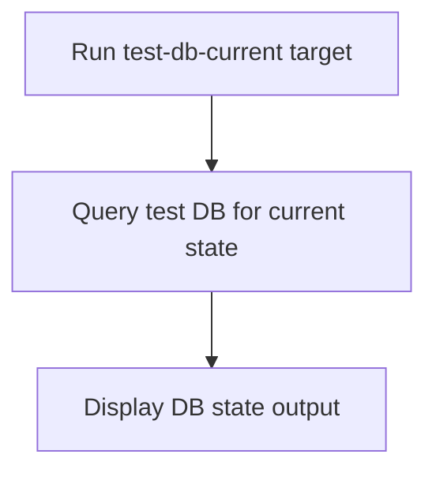

# User Story: test-db-current

## Motivation
Checking the current state of the test database is essential for verifying schema, data, and migration status. The test-db-current target provides a standardized way to inspect the current state of the test DB in the containerized environment.

## Actors
- Developers: Verify the current schema or data in the test database.
- CI/CD Systems: Validate DB state as part of the build pipeline.

## Preconditions
- Docker and Docker Compose are installed and running.
- The test DB container is up and available.

## Step-by-Step Actions
1. Run the test-db-current target:
   ```bash
   make -f Makefile.ai-test test-db-current
   ```
2. The target queries the test DB for its current state (e.g., schema version, tables, or data).
3. Output is displayed in the terminal for review.

### Workflow Diagram


## Expected Outcomes
- The current state of the test DB is displayed for review.
- Developers and CI/CD systems can verify schema, data, or migration status.
- Any discrepancies are surfaced for resolution.

## Best Practices
- Use test-db-current after migrations or before running tests to verify DB state.
- Document common queries or checks for team reference.
- Integrate this target into CI/CD pipelines for automated validation.
- Save DB state output for further analysis:
  ```bash
  make -f Makefile.ai-test test-db-current > db_state.txt
  ```

## Troubleshooting
- **Unexpected schema:** Compare the output to the expected schema or migration plan.
- **Missing tables/data:** Ensure all migrations have been applied and the DB is initialized.
- **State not updating:** Check for migration errors or DB container issues.
