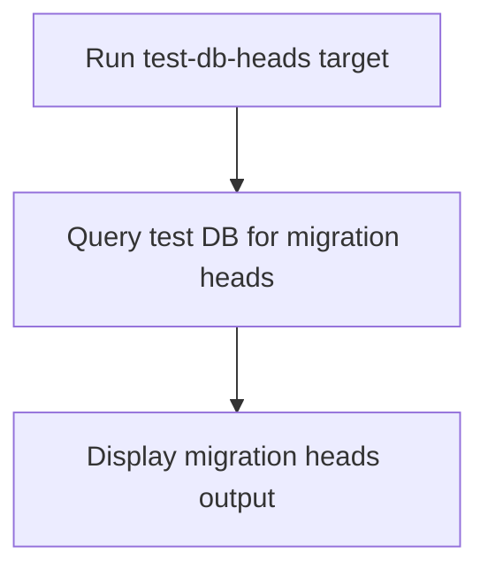

# User Story: test-db-heads

## Motivation
Viewing the current migration heads in the test database is important for tracking schema changes and ensuring all migrations are applied. The test-db-heads target provides a standardized way to list migration heads in the test DB.

## Actors
- Developers: Check migration heads to verify schema status.
- CI/CD Systems: Validate migration state as part of the build pipeline.

## Preconditions
- Docker and Docker Compose are installed and running.
- The test DB container is up and available.

## Step-by-Step Actions
1. Run the test-db-heads target:
   ```bash
   make -f Makefile.ai-test test-db-heads
   ```
2. The target queries the test DB for current migration heads.
3. Output is displayed in the terminal for review.

### Workflow Diagram


## Expected Outcomes
- The current migration heads in the test DB are displayed for review.
- Developers and CI/CD systems can verify that all migrations are applied.
- Any discrepancies are surfaced for resolution.

## Best Practices
- Use test-db-heads after applying migrations to verify schema status.
- Document common checks for team reference.
- Integrate this target into CI/CD pipelines for automated validation.
- Save migration heads output for further analysis:
  ```bash
  make -f Makefile.ai-test test-db-heads > migration_heads.txt
  ```

## Troubleshooting
- **Multiple heads:** Indicates a migration conflict or branch; resolve by merging or squashing migrations.
- **No heads found:** Ensure migrations have been applied and the DB is not empty.
- **Heads not updating:** Check for migration errors or DB state issues.
