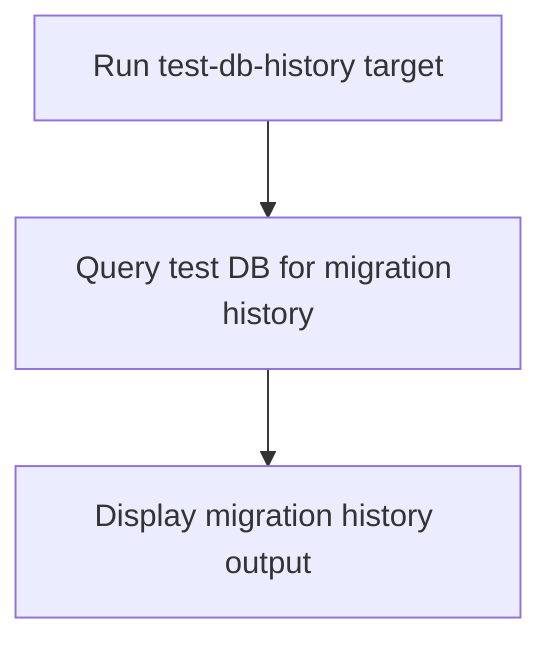

# User Story: test-db-history

## Motivation
Reviewing the migration history in the test database is important for tracking applied schema changes and debugging migration issues. The test-db-history target provides a standardized way to view the migration history in the test DB.

## Actors
- Developers: Review migration history to debug or verify schema changes.
- CI/CD Systems: Validate migration history as part of the build pipeline.

## Preconditions
- Docker and Docker Compose are installed and running.
- The test DB container is up and available.

## Step-by-Step Actions
1. Run the test-db-history target:
   ```bash
   make -f Makefile.ai-test test-db-history
   ```
2. The target queries the test DB for its migration history.
3. Output is displayed in the terminal for review.

### Workflow Diagram


## Expected Outcomes
- The migration history in the test DB is displayed for review.
- Developers and CI/CD systems can verify which migrations have been applied.
- Any discrepancies are surfaced for resolution.

## Best Practices
- Use test-db-history after applying or troubleshooting migrations.
- Document common checks for team reference.
- Integrate this target into CI/CD pipelines for automated validation.
- Save migration history output for further analysis:
  ```bash
  make -f Makefile.ai-test test-db-history > migration_history.txt
  ```

## Troubleshooting
- **Missing migrations:** Check the output for gaps or missing migration versions.
- **Unexpected migrations:** Review the history for migrations that should not be present.
- **History not updating:** Ensure migrations are being applied and the DB is not in a detached state.
