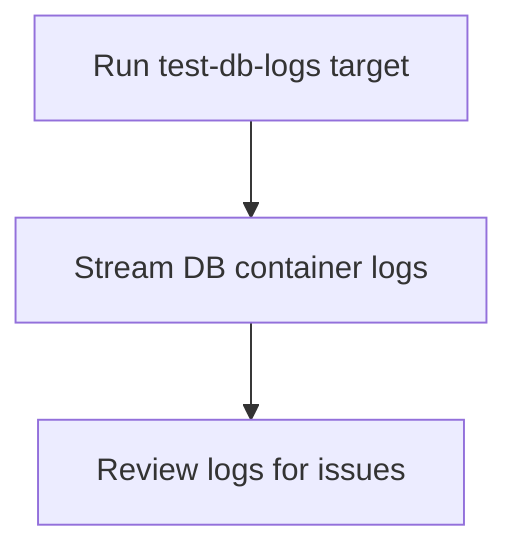

# User Story: test-db-logs

## Motivation
Accessing the test database container logs is crucial for diagnosing database errors, monitoring migrations, and debugging test failures related to the database. The test-db-logs target provides a standardized way to view logs from the test DB container.

## Actors
- Developers: Review DB logs to debug migration or test failures.
- QA Engineers: Monitor DB behavior during test cycles.
- CI/CD Systems: Collect logs for analysis and reporting.

## Preconditions
- Docker and Docker Compose are installed and running.
- The test DB container has been started (e.g., via test-up or test-quickstart).

## Step-by-Step Actions
1. Run the test-db-logs target:
   ```bash
   make -f Makefile.ai-test test-db-logs
   ```
2. The target streams or displays the logs from the test DB container.
3. Review the logs for errors, warnings, or other relevant information.

### Workflow Diagram


## Expected Outcomes
- DB logs are displayed in the terminal for review.
- Developers and QA can quickly identify and diagnose database issues.
- Logs can be saved or shared for further analysis.

## Best Practices
- Use test-db-logs after migration or test failures to investigate root causes.
- Monitor logs during schema changes or complex test cycles.
- Integrate log review into your debugging workflow.
- Document common log patterns and troubleshooting tips for the team.
- Save logs to a file for further analysis:
  ```bash
  make -f Makefile.ai-test test-db-logs > db_logs.txt
  ```

## Troubleshooting
- **Connection errors:** Check for network issues or incorrect service names in the logs.
- **Migration failures:** Look for error messages related to missing tables, permissions, or SQL syntax.
- **Permission problems:** Ensure the DB user has the correct privileges; review log entries for access denied errors.
- **Container not running:** Verify the test DB container is up and healthy before running this target.
