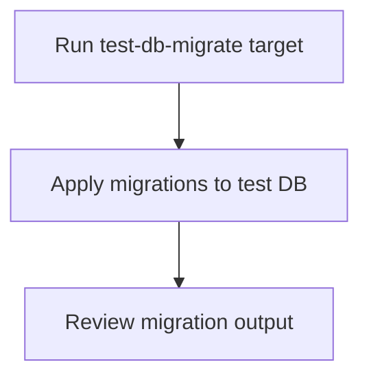

# User Story: test-db-migrate

## Motivation
Applying database migrations in the test environment ensures the schema is up to date and matches the latest application code. The test-db-migrate target standardizes this process for all contributors and CI systems.

## Actors
- Developers: Apply migrations before running tests or after schema changes.
- CI/CD Systems: Ensure the test DB schema is current before executing tests.

## Preconditions
- Docker and Docker Compose are installed and running.
- The test DB container is up and available.
- Migration scripts are present in the migrations directory.

## Step-by-Step Actions
1. Run the test-db-migrate target:
   ```bash
   make -f Makefile.ai-test test-db-migrate
   ```
2. The target applies all pending migrations to the test database.
3. Review the output for success or errors.

### Workflow Diagram


## Expected Outcomes
- All migrations are applied to the test database.
- The schema is up to date and ready for tests.
- Errors are surfaced early, before test execution.

## Best Practices
- Run test-db-migrate after making schema changes or before running tests.
- Review migration output for errors or warnings.
- Keep migration scripts well-documented and versioned.
- Document any manual migration steps required for special cases.
- Save migration output for further analysis:
  ```bash
  make -f Makefile.ai-test test-db-migrate > db_migrate_output.txt
  ```

## Troubleshooting
- **Migration failures:** Review the output for SQL errors, missing tables, or permission issues.
- **Schema not updating:** Ensure the correct migration scripts are present and applied.
- **Container not running:** Verify the test DB container is up and healthy before running this target.
