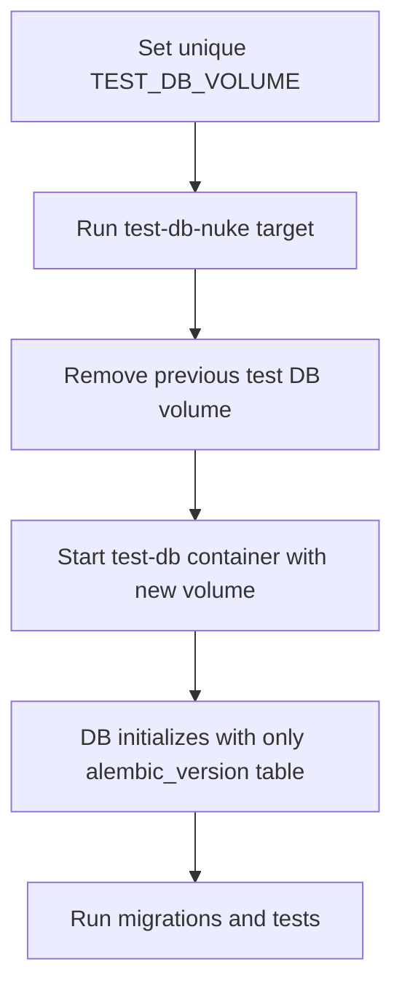

# User Story: Dynamic Test DB Nuke with Unique Volume Names

## Motivation
Developers and CI pipelines need a reliable way to guarantee a truly clean PostgreSQL test database for every test run. Persistent Docker volumes can retain old data, causing test pollution and migration failures. By dynamically generating a unique volume name for each nuke, we ensure every test run starts with a pristine database state.

## Actors
- Developers
- CI/CD systems

## Preconditions
- The project uses Docker Compose for test environments.
- The Makefile.ai-test and docker-compose.test.yml are configured to accept a `TEST_DB_VOLUME` environment variable.

## Steps
1. Developer or CI sets a unique value for `TEST_DB_VOLUME` (e.g., `mytestvol_$(date +%s)`).
2. Run `make -f Makefile.ai-test test-db-nuke`.
3. The Makefile:
   - Removes any previous test DB volume (if present).
   - Brings down all test containers and volumes.
   - Builds and starts the test-db container with the new unique volume name.
4. The database container initializes with only the required extensions and the `alembic_version` table.
5. Developer or CI can now run migrations and tests on a truly empty database.

## Expected Outcomes
- No application tables exist in the test DB after nuke, except for `alembic_version`.
- Each test run is isolated from previous runs.
- Migration and test failures due to leftover data are eliminated.

## Step-by-Step Actions
1. Developer or CI sets a unique value for `TEST_DB_VOLUME` (e.g., `mytestvol_$(date +%s)`).
2. Run `make -f Makefile.ai-test test-db-nuke`.
3. The Makefile:
   - Removes any previous test DB volume (if present).
   - Brings down all test containers and volumes.
   - Builds and starts the test-db container with the new unique volume name.
4. The database container initializes with only the required extensions and the `alembic_version` table.
5. Developer or CI can now run migrations and tests on a truly empty database.

### Workflow Diagram


## Best Practices
- Always use a unique volume name for each nuke in local and CI workflows to guarantee a clean slate.
- Automate volume name generation using timestamps or unique IDs to avoid accidental reuse.
- Inspect the DB state after nuke to verify cleanliness before running migrations or tests.
- Document the nuke process and troubleshooting steps for the team.
- Save nuke output for further analysis:
  ```bash
  TEST_DB_VOLUME=mytestvol_$(date +%s) make -f Makefile.ai-test test-db-nuke > nuke_output.txt
  ```

## Troubleshooting
- **Old data persists:** Ensure the volume name is unique and Docker has removed the previous volume.
- **Nuke fails:** Check the output for errors related to volume removal or container shutdown.
- **DB not initializing:** Review logs for permission or configuration issues in the new volume. 