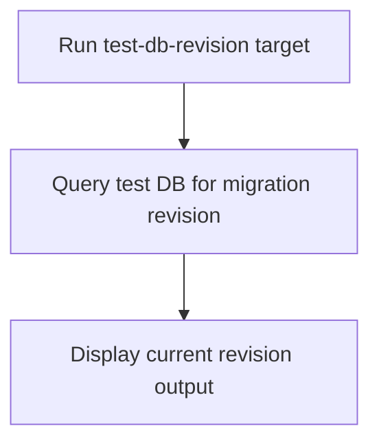

# User Story: test-db-revision

## Motivation
Checking the current migration revision in the test database is essential for tracking schema state, debugging migration issues, and ensuring consistency across environments. The test-db-revision target provides a standardized way to view the current migration revision in the test DB.

## Actors
- Developers: Check the current migration revision before or after migrations.
- CI/CD Systems: Validate schema state as part of the build pipeline.

## Preconditions
- Docker and Docker Compose are installed and running.
- The test DB container is up and available.

## Step-by-Step Actions
1. Run the test-db-revision target:
   ```bash
   make -f Makefile.ai-test test-db-revision
   ```
2. The target queries the test DB for its current migration revision.
3. Output is displayed in the terminal for review.

### Workflow Diagram


## Expected Outcomes
- The current migration revision in the test DB is displayed for review.
- Developers and CI/CD systems can verify schema state before or after migrations.
- Any discrepancies are surfaced for resolution.

## Best Practices
- Use test-db-revision after applying migrations to verify schema state.
- Document revision hashes in migration logs or PRs for traceability.
- Integrate this target into CI/CD pipelines for automated validation.
- Save revision output for further analysis:
  ```bash
  make -f Makefile.ai-test test-db-revision > db_revision.txt
  ```

## Troubleshooting
- **Revision mismatch:** Compare the output to the expected revision in your migration plan.
- **Revision not updating:** Ensure migrations are being applied and the DB is not in a detached state.
- **Output errors:** Check for DB connection issues or migration script problems.
