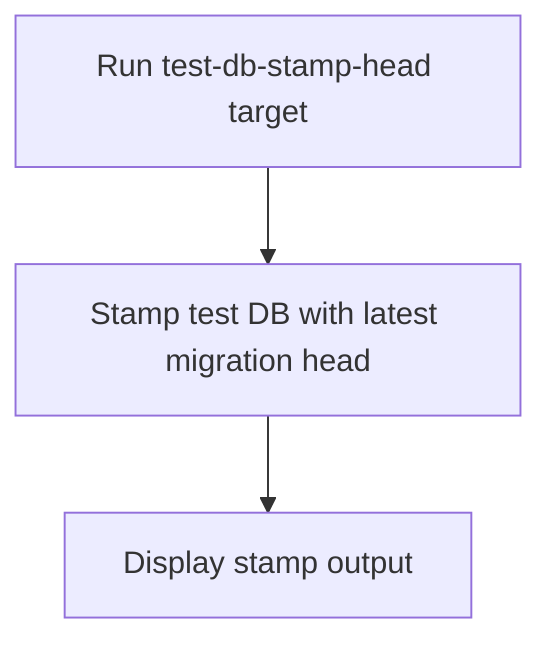

# User Story: test-db-stamp-head

## Motivation
Stamping the test database with the latest migration head is useful for synchronizing schema state without applying migrations, especially in cases where manual intervention is needed. The test-db-stamp-head target standardizes this process for all contributors and CI systems.

## Actors
- Developers: Stamp the DB head to synchronize schema state.
- CI/CD Systems: Ensure DB is marked as up-to-date for automated workflows.

## Preconditions
- Docker and Docker Compose are installed and running.
- The test DB container is up and available.

## Step-by-Step Actions
1. Run the test-db-stamp-head target:
   ```bash
   make -f Makefile.ai-test test-db-stamp-head
   ```
2. The target stamps the test DB with the latest migration head (without applying migrations).
3. Output is displayed in the terminal for review.

### Workflow Diagram


## Expected Outcomes
- The test DB is stamped with the latest migration head.
- Developers and CI/CD systems can synchronize schema state without running migrations.
- Any discrepancies are surfaced for resolution.

## Best Practices
- Use test-db-stamp-head when manual schema synchronization is needed.
- Document when and why the DB was stamped for team reference.
- Integrate this target into CI/CD pipelines for automated workflows.
- Save stamp output for further analysis:
  ```bash
  make -f Makefile.ai-test test-db-stamp-head > stamp_output.txt
  ```

## Troubleshooting
- **Stamp not applied:** Check for errors in the output and ensure the DB is accessible.
- **Schema mismatch:** Compare the stamped revision to the expected migration plan.
- **Output errors:** Review logs for permission or connection issues.
