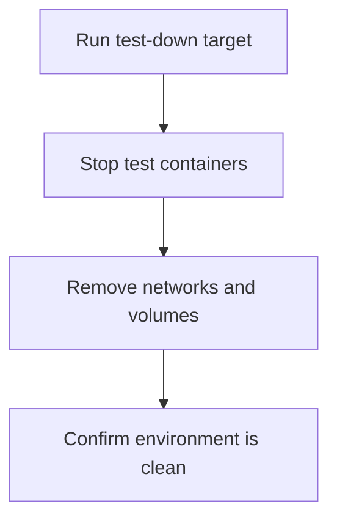

# User Story: test-down

## Motivation
Stopping and cleaning up test containers, networks, and volumes is essential to free up system resources, prevent conflicts, and ensure a clean environment for future test runs.

## Actors
- Developers: Stop test containers after running tests or before switching branches.
- CI/CD Systems: Clean up after test jobs to maintain a stable build pipeline.

## Preconditions
- Test containers, networks, or volumes are running from previous test cycles.

## Step-by-Step Actions
1. Run the test-down target:
   ```bash
   make -f Makefile.ai-test test-down
   ```
2. The target stops and removes all test containers, networks, and volumes defined in `docker-compose.test.yml`.
3. The environment is now clean and ready for a fresh test or dev cycle.

### Workflow Diagram


## Expected Outcomes
- No running containers, networks, or volumes from previous test runs.
- The next test or dev run starts from a known, clean state.
- Reduced risk of environment-related errors.

## Best Practices
- Run test-down after major test cycles or before switching branches.
- Integrate test-down into CI/CD pipelines to ensure clean builds.
- Use this target whenever you encounter unexplained test failures or environment conflicts.
- Document any additional cleanup steps needed for new services or dependencies.
- Save logs from the shutdown process for troubleshooting:
  ```bash
  make -f Makefile.ai-test test-down > test_down_logs.txt
  ```
- Troubleshoot common issues such as containers not stopping or volumes not being removed by checking the logs and Docker status.
