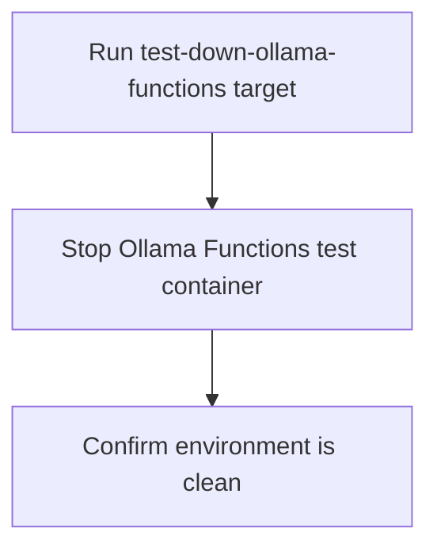

# User Story: test-down-ollama-functions

## Motivation
Stopping and cleaning up the Ollama Functions test container is essential to free up system resources, prevent conflicts, and ensure a clean environment for future test runs. The test-down-ollama-functions target standardizes this process for all contributors and CI systems.

## Actors
- Developers: Stop the Ollama Functions container after running tests or before switching branches.
- CI/CD Systems: Clean up after test jobs to maintain a stable build pipeline.

## Preconditions
- The Ollama Functions test container is running from previous test cycles.

## Step-by-Step Actions
1. Run the test-down-ollama-functions target:
   ```bash
   make -f Makefile.ai-test test-down-ollama-functions
   ```
2. The target stops and removes the Ollama Functions test container as defined in `docker-compose.test.yml`.
3. The environment is now clean and ready for a fresh test or dev cycle.

### Workflow Diagram


## Expected Outcomes
- The Ollama Functions test container is stopped and removed.
- The next test or dev run starts from a known, clean state.
- Reduced risk of environment-related errors.

## Best Practices
- Run test-down-ollama-functions after major test cycles or before switching branches.
- Integrate this target into CI/CD pipelines to ensure clean builds.
- Use this target whenever you encounter unexplained test failures or environment conflicts.
- Document any additional cleanup steps needed for new services or dependencies.
- Save logs from the shutdown process for troubleshooting:
  ```bash
  make -f Makefile.ai-test test-down-ollama-functions > ollama_down_logs.txt
  ```

## Troubleshooting
- **Container not stopping:** Check the logs for error messages and ensure no dependent services are running.
- **Resources not released:** Verify that Docker has removed the container and freed up ports and volumes.
- **Service still accessible:** Confirm the container is fully stopped and not running in the background.
