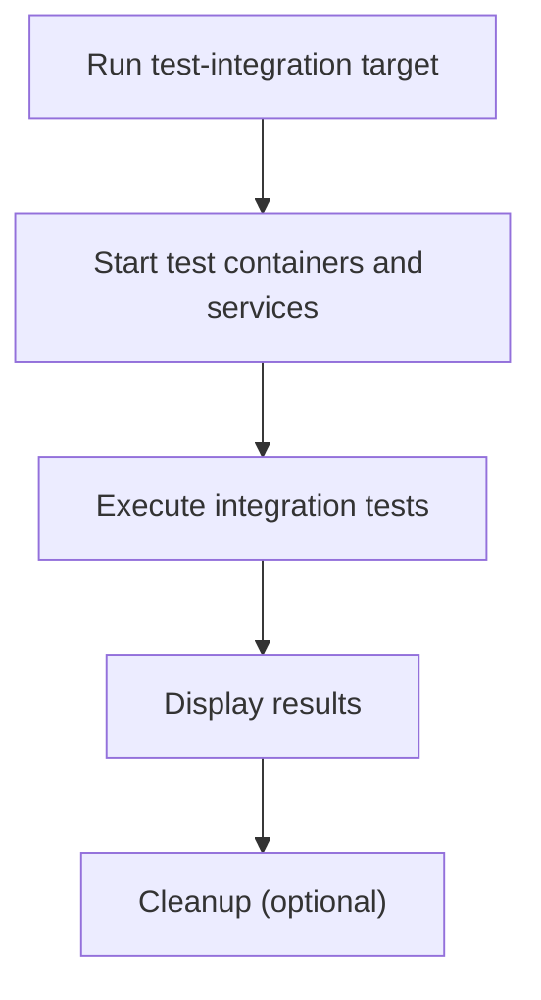

# User Story: test-integration

## Motivation
Integration tests verify that multiple components of the system work together as expected. They help catch issues that only appear when services interact, such as database access, API calls, or external dependencies.

## Actors
- Developers: Write and run integration tests to validate system interactions.
- CI/CD Systems: Automatically execute integration tests on every push or pull request.
- QA Engineers: Use integration tests to validate end-to-end workflows.

## Preconditions
- Docker and Docker Compose are installed and running.
- The test containers and required services (e.g., test-db, test-api) are available.
- Integration tests are located in the appropriate directory (e.g., `tests/integration/`).

## Step-by-Step Actions
1. Run the integration test suite:
   ```bash
   make -f Makefile.ai-test test-integration
   ```
   Optionally, pass extra pytest arguments:
   ```bash
   make -f Makefile.ai-test test-integration PYTEST_ARGS="-k <pattern>"
   ```
2. The target starts the required test containers and services.
3. Integration tests are executed, connecting to real services as needed.
4. Results are displayed in the terminal.

### Workflow Diagram


## Expected Outcomes
- All integration tests are executed in a clean, isolated Docker environment.
- Results are displayed, including any failures or errors.
- System interactions are validated end-to-end.

## Best Practices
- Write integration tests for workflows involving multiple components or services.
- Use real services (not mocks) for integration tests.
- Clean up test data between runs to ensure isolation.
- Run integration tests before merging major changes.
- Document any additional test targets or workflows in user stories for discoverability.
- Save integration test output for further analysis:
  ```bash
  make -f Makefile.ai-test test-integration > integration_test_output.txt
  ```
- Troubleshoot common issues such as service connection failures or data contamination by reviewing the output and checking service health and test isolation.
