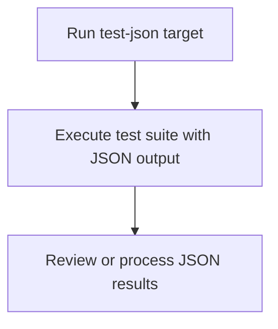

# User Story: test-json

## Motivation
Running tests with JSON output is useful for integrating with external tools, CI/CD dashboards, or automated reporting systems. The test-json target standardizes this process for all contributors and CI systems.

## Actors
- Developers: Generate JSON test reports for debugging or sharing results.
- CI/CD Systems: Parse JSON output for dashboards or automated analysis.

## Preconditions
- Docker and Docker Compose are installed and running.
- The workspace is at the project root.

## Step-by-Step Actions
1. Run the test-json target:
   ```bash
   make -f Makefile.ai-test test-json
   ```
2. The target executes the test suite and outputs results in JSON format.
3. Review or process the JSON output as needed.

### Workflow Diagram


## Expected Outcomes
- Test results are output in JSON format.
- Developers and CI/CD systems can process or analyze results programmatically.
- Integration with dashboards or reporting tools is enabled.

## Best Practices
- Use test-json for automated reporting or integration with external tools.
- Validate the JSON output format before using in production workflows.
- Document any custom JSON processing scripts for the team.
- Save JSON output for further analysis:
  ```bash
  make -f Makefile.ai-test test-json > test_results.json
  ```

## Troubleshooting
- **Malformed JSON:** Check for errors in the test runner or output formatting.
- **Missing results:** Ensure the test suite completes successfully and outputs to the correct file.
- **Integration failures:** Validate the JSON schema matches the requirements of downstream tools or dashboards.
