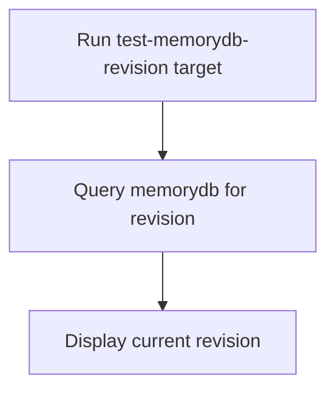

# User Story: test-memorydb-revision

## Motivation
Managing and reviewing memorydb schema revisions is essential for tracking changes, debugging migration issues, and ensuring consistency across environments. The test-memorydb-revision target provides a standardized way to view the current revision of the memorydb schema in the test environment.

## Actors
- Developers: Check the current memorydb revision before or after migrations.
- CI/CD Systems: Validate schema state as part of the build pipeline.

## Preconditions
- Docker and Docker Compose are installed and running.
- The test memorydb container is up and available.

## Step-by-Step Actions
1. Run the test-memorydb-revision target:
   ```bash
   make -f Makefile.ai-test test-memorydb-revision
   ```
2. The target queries the memorydb for its current schema revision.
3. Review the output for the current revision hash or version.

### Workflow Diagram


## Expected Outcomes
- The current memorydb schema revision is displayed.
- Developers and CI can verify schema state before or after migrations.
- Any discrepancies are surfaced for resolution.

## Best Practices
- Check the memorydb revision after applying migrations.
- Use revision info to debug migration or schema drift issues.
- Document revision hashes in migration logs or PRs for traceability.
- Save revision output for further analysis:
  ```bash
  make -f Makefile.ai-test test-memorydb-revision > memorydb_revision.txt
  ```

## Troubleshooting
- **Revision mismatch:** Compare the output to the expected revision in your migration plan.
- **Revision not updating:** Ensure migrations are being applied and the memorydb is not in a detached state.
- **Output errors:** Check for DB connection issues or migration script problems.
