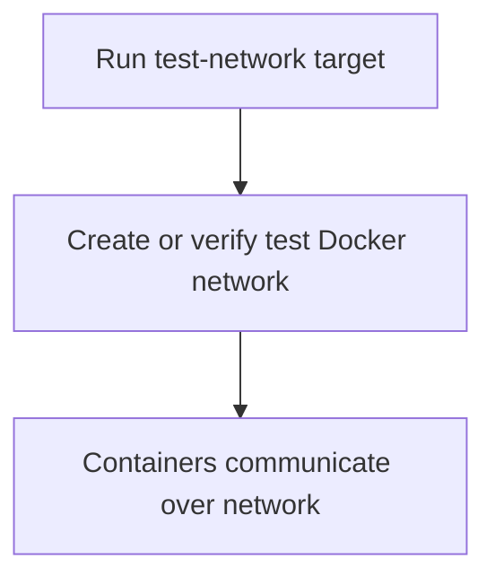

# User Story: test-network

## Motivation
Managing the test Docker network is essential for ensuring isolated, reliable communication between containers during test runs. The test-network target standardizes network setup and management for all contributors and CI systems.

## Actors
- Developers: Ensure the test network is available for container communication.
- CI/CD Systems: Set up the test network before running tests.

## Preconditions
- Docker and Docker Compose are installed and running.
- The workspace is at the project root.

## Step-by-Step Actions
1. Run the test-network target:
   ```bash
   make -f Makefile.ai-test test-network
   ```
2. The target creates or verifies the test Docker network.
3. Containers can now communicate over the test network.

### Workflow Diagram


## Expected Outcomes
- The test Docker network is created or verified.
- Containers can communicate reliably during test runs.
- Network-related test failures are minimized.

## Best Practices
- Use test-network before running tests that require inter-container communication.
- Document network setup steps for new contributors.
- Troubleshoot network issues by verifying network status with this target.
- Save network status output for further analysis:
  ```bash
  make -f Makefile.ai-test test-network > network_status.txt
  ```

## Troubleshooting
- **Network not found:** Ensure Docker is running and the network name matches the configuration.
- **Container communication failures:** Check that all containers are attached to the correct network.
- **Port conflicts:** Verify that no other services are using the required ports.
