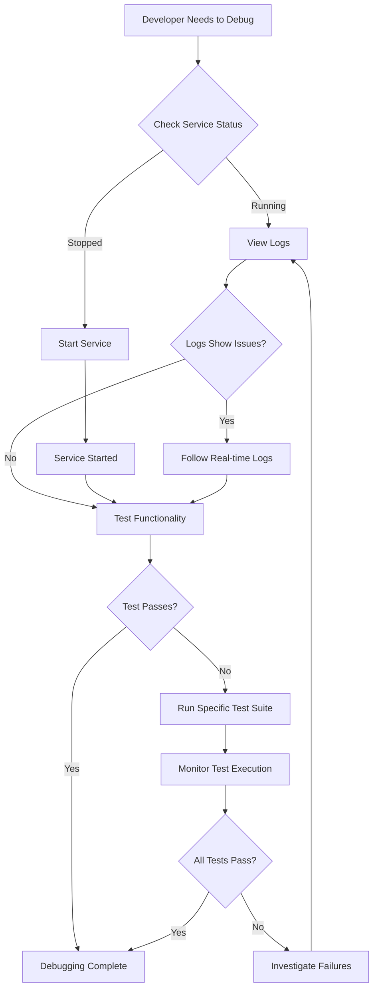

# Debugging Test Ollama Functions Service

## Motivation
The semantic search functionality in our AI-IDE API requires the test-ollama-functions service to be running for embedding generation. When tests fail or debugging is needed, developers need easy-to-use Makefile targets to manage and monitor this service.

## Actors
- **Developer**: Needs to debug semantic search tests
- **QA Engineer**: Needs to verify semantic search functionality
- **DevOps Engineer**: Needs to troubleshoot service issues

## Preconditions
- Docker and Docker Compose are installed
- The project is set up with test environment
- Test database is initialized

## Step-by-Step Actions

### 1. Check Service Status
```bash
make -f Makefile.ai-test test-ollama-functions-status
```
This shows:
- Container status (running/stopped)
- Health check response
- Service availability

### 2. Start the Service
```bash
make -f Makefile.ai-test test-ollama-functions-up
```
This starts the service with:
- Proper profile configuration (llm-test)
- Dependency management
- Helpful output messages

### 3. View Recent Logs
```bash
make -f Makefile.ai-test test-ollama-functions-logs
```
Shows the last 50 log entries for debugging.

### 4. Follow Logs in Real-Time
```bash
make -f Makefile.ai-test test-ollama-functions-debug
```
Follows logs continuously (Ctrl+C to stop).

### 5. Test Functionality
```bash
make -f Makefile.ai-test test-ollama-functions-test
```
Tests the embedding endpoint directly.

### 6. Start Full Test Environment
```bash
make -f Makefile.ai-test test-up-with-ollama
```
Starts all required services for semantic search testing.

### 7. Run Semantic Search Tests
```bash
make -f Makefile.ai-test test-semantic-search
```
Runs only the semantic search test suite.

### 8. Run Advanced Search Tests
```bash
make -f Makefile.ai-test test-advanced-search
```
Runs the complete advanced search test suite.

## Expected Outcomes

### Successful Service Startup
- Container shows as "Up" in status
- Logs show "Uvicorn running on http://0.0.0.0:8000"
- Service responds to health checks

### Successful Test Execution
- Semantic search tests pass
- Embedding generation works (when Ollama is available)
- API endpoints respond correctly

### Debugging Capabilities
- Real-time log monitoring
- Direct API testing
- Service status verification
- Isolated test execution

## Common Issues and Solutions

### Service Won't Start
- **Issue**: "no such service: test"
- **Solution**: Use both `--profile test --profile llm-test` flags

### Health Check Fails
- **Issue**: "Service not responding on port 8000"
- **Solution**: Service runs inside Docker network, use `test-ollama-functions-test` target instead

### Embedding Generation Fails
- **Issue**: "404 Client Error: Not Found for url: http://host.docker.internal:11434/api/embeddings"
- **Solution**: Expected when Ollama is not running locally. Service is working correctly.

### Tests Fail with Import Errors
- **Issue**: Module import failures
- **Solution**: Ensure test environment is properly set up with `test-up-with-ollama`

## Best Practices

### Service Management
- Always use the Makefile targets instead of direct docker-compose commands
- Use `test-up-with-ollama` for full environment setup
- Check service status before running tests

### Debugging Workflow
1. Check service status first
2. View recent logs for errors
3. Follow logs in real-time if needed
4. Test functionality directly
5. Run specific test suites

### Test Execution
- Use `test-semantic-search` for focused testing
- Use `test-advanced-search` for comprehensive testing
- Monitor logs during test execution

## Related Documentation
- [LLM Testing Guide](docs/llm_testing.md)
- [Test Environment Setup](docs/onboarding/TESTING.md)
- [Semantic Search Implementation](docs/advanced_search.md)

## Mermaid Diagram



## Success Metrics
- Service starts successfully on first attempt
- Logs are accessible and informative
- Tests run without environment issues
- Debugging time is reduced
- Service status is easily verifiable 