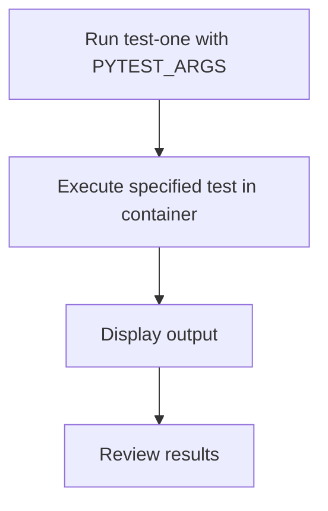

# User Story: test-one

## Motivation
Running a single test or a specific test file is useful for focused debugging and rapid feedback during development. The test-one target standardizes this process for all contributors.

## Actors
- Developers: Run a single test or test file to debug or verify changes.

## Preconditions
- Docker and Docker Compose are installed and running.
- The workspace is at the project root.
- The test containers are up and available.
- The specific test or file to run is known.

## Step-by-Step Actions
1. Run the test-one target with the desired test:
   ```bash
   make -f Makefile.ai-test test-one PYTEST_ARGS="tests/unit/test_example.py::test_function"
   ```
2. The target executes the specified test or test file in the test environment.
3. Output is displayed in the terminal for review.

### Workflow Diagram


## Expected Outcomes
- The specified test or test file is executed in the correct environment.
- Output and results are displayed for review.
- Developers receive rapid feedback on specific changes.

## Best Practices
- Use test-one for focused debugging or rapid iteration.
- Always specify the full test path in PYTEST_ARGS.
- Ensure the test environment is up before running test-one.
- Document common test-one commands for team reference.
- Save output for further analysis:
  ```bash
  make -f Makefile.ai-test test-one PYTEST_ARGS="..." > test_one_output.txt
  ```

## Troubleshooting
- **Test not found:** Double-check the test path and function name in PYTEST_ARGS.
- **Import errors:** Ensure all dependencies are installed and the test environment is up.
- **Unexpected failures:** Review the output for stack traces and error messages.
