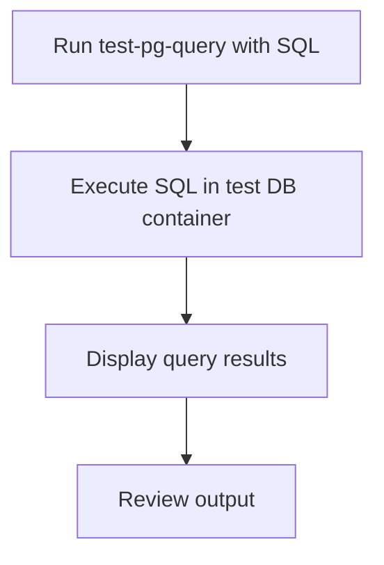

# User Story: test-pg-query

## Motivation
Running ad-hoc SQL queries against the test PostgreSQL database is useful for debugging, inspecting data, and verifying schema changes. The test-pg-query target provides a standardized way to execute SQL queries in the test environment.

## Actors
- Developers: Run custom SQL queries for debugging or validation.
- QA Engineers: Inspect test data or schema state.

## Preconditions
- Docker and Docker Compose are installed and running.
- The test DB container is up and available.
- The user has a valid SQL query to execute.

## Step-by-Step Actions
1. Run the test-pg-query target with the desired SQL command:
   ```bash
   make -f Makefile.ai-test test-pg-query SQL="SELECT * FROM users;"
   ```
2. The target executes the SQL query inside the test DB container.
3. Output is displayed in the terminal for review.

### Workflow Diagram


## Expected Outcomes
- The specified SQL query is executed in the test database.
- Results are displayed for review and debugging.
- Developers can inspect data or schema state efficiently.

## Best Practices
- Use test-pg-query for ad-hoc queries during debugging.
- Always specify the full SQL command in the SQL variable.
- Ensure the test environment is up before running test-pg-query.
- Document common queries for team reference.
- Save query output for further analysis:
  ```bash
  make -f Makefile.ai-test test-pg-query SQL="SELECT * FROM users;" > pg_query_output.txt
  ```

## Troubleshooting
- **Query fails:** Check the SQL syntax and ensure the table exists.
- **No results:** Verify the query and data in the test DB.
- **Permission errors:** Ensure the DB user has the correct privileges.
- **Container not running:** Verify the test DB container is up and healthy before running this target.
