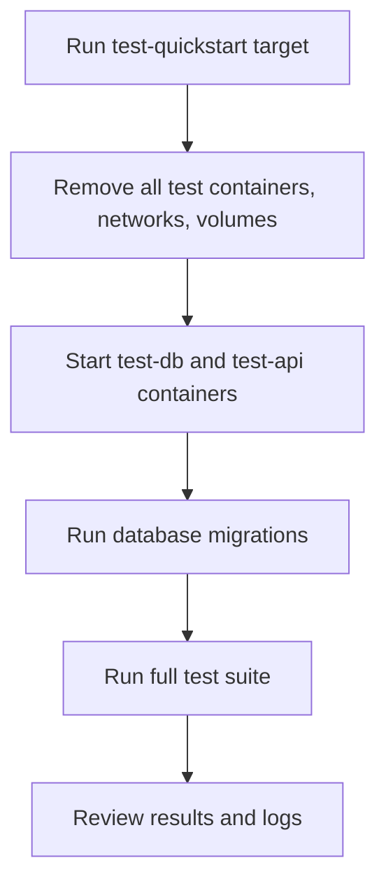

# User Story: test-quickstart

## Motivation
Provide new contributors and existing developers with a one-command workflow to fully reset, initialize, and test the project in a clean environment. This ensures everyone can quickly verify that the codebase builds, migrates, and passes all tests from a fresh state, reducing onboarding friction and debugging time.

## Actors
- New Contributors: Need a reliable way to get the project running and verify their setup.
- Developers: Want to quickly reset and verify the test environment after major changes.
- CI/CD Systems: May use this workflow to ensure a clean, repeatable build and test cycle.

## Preconditions
- Docker and Docker Compose are installed and running.
- The project repository has been cloned locally.
- No other containers are running on conflicting ports.

## Step-by-Step Actions
1. Run the quickstart target:
   ```bash
   make -f Makefile.ai-test test-quickstart
   ```
2. The target executes:
   - `docker compose -f docker-compose.test.yml down -v` (removes all test containers, networks, and volumes)
   - `docker compose -f docker-compose.test.yml up -d test-db test-api` (starts the test database and API containers)
   - Runs database migrations to ensure the schema is up to date
   - Runs the full test suite using the `test` target
3. The output of each step is displayed for review.
4. On completion, the user can review the test results and logs.

### Workflow Diagram


## Expected Outcomes
- The test environment is fully reset and rebuilt from scratch.
- All migrations are applied to a fresh database.
- The full test suite runs and results are displayed.
- Any issues with setup, migrations, or tests are surfaced early and clearly.

## Best Practices
- Use test-quickstart when onboarding new contributors or after major dependency or schema changes.
- Run this workflow before submitting pull requests to ensure a clean, passing test suite.
- If you encounter environment or migration issues, use test-quickstart to reset and verify your setup.
- Document any additional manual steps required for new services or dependencies.
- Save output for further analysis:
  ```bash
  make -f Makefile.ai-test test-quickstart > quickstart_output.txt
  ```

## Troubleshooting
- **Containers fail to start:** Check the output for errors and ensure Docker is running.
- **Migration errors:** Review the logs for missing tables, permission issues, or failed scripts.
- **Test failures:** Inspect the test output for stack traces and error messages.
- **Onboarding issues:** Ensure all prerequisites (Docker, Compose, etc.) are installed and the repo is at the project root.

## Additional Onboarding Paths & Resources

After you have set up your project and verified your local environment, you may want to explore other ways to use the AI IDE API:

- **External Project Memory API Onboarding:**
  Use the AI IDE API as a hosted memory (vector) server for your own project, with no Docker or DB access required.
  [See External Project Memory API Onboarding →](../external/memory_api_onboarding.md)

- **Full API Reference:**
  Explore all endpoints and try them interactively at `/docs` on your API host.

- **Internal Developer Onboarding:**
  [See this quickstart (current doc)](test_quickstart.md) for local development and testing.
