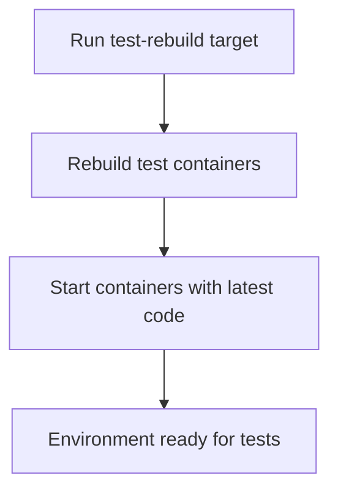

# User Story: test-rebuild

## Motivation
Rebuilding test containers ensures that the latest code, dependencies, and configuration changes are reflected in the test environment. The test-rebuild target standardizes this process for all contributors and CI systems.

## Actors
- Developers: Rebuild test containers after code or dependency changes.
- CI/CD Systems: Ensure a fresh environment for each test run.

## Preconditions
- Docker and Docker Compose are installed and running.
- The workspace is at the project root.

## Step-by-Step Actions
1. Run the test-rebuild target:
   ```bash
   make -f Makefile.ai-test test-rebuild
   ```
2. The target rebuilds all test containers defined in `docker-compose.test.yml`.
3. Containers are started with the latest code and dependencies.
4. The environment is now ready for running tests.

### Workflow Diagram


## Expected Outcomes
- All test containers are rebuilt with the latest code and dependencies.
- The environment is clean and up to date.
- Developers and CI/CD systems can proceed with test execution.

## Best Practices
- Run test-rebuild after major code or dependency changes.
- Ensure containers are healthy before starting tests.
- Use test-rebuild as part of your development and CI/CD workflow.
- Document any additional rebuild steps needed for new services or dependencies.
- Save rebuild output for further analysis:
  ```bash
  make -f Makefile.ai-test test-rebuild > rebuild_output.txt
  ```

## Troubleshooting
- **Build failures:** Check the output for errors in Dockerfile or dependency installation.
- **Containers not starting:** Review logs for startup errors or missing dependencies.
- **Old code persists:** Ensure the rebuild step is not being cached; use `--no-cache` if needed.
