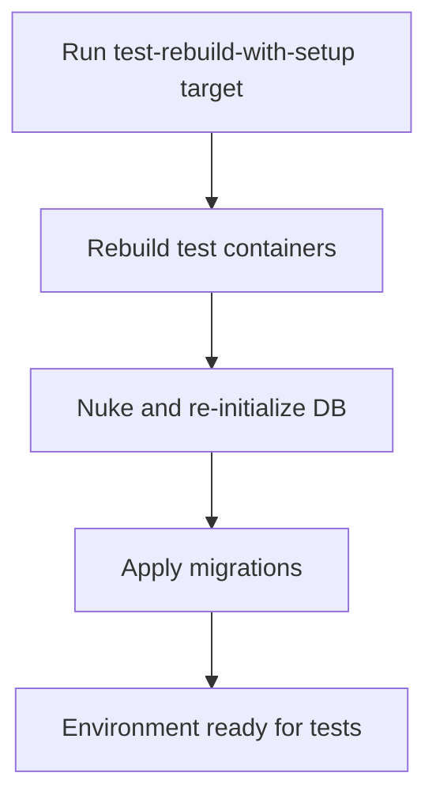

# User Story: test-rebuild-with-setup

## Motivation
Rebuilding test containers and re-initializing the environment ensures that all code, dependencies, and database state are fresh and consistent. The test-rebuild-with-setup target automates this process for contributors and CI systems.

## Actors
- Developers: Rebuild and re-initialize the test environment after major changes.
- CI/CD Systems: Ensure a clean, consistent environment for each test run.

## Preconditions
- Docker and Docker Compose are installed and running.
- The workspace is at the project root.

## Step-by-Step Actions
1. Run the test-rebuild-with-setup target:
   ```bash
   make -f Makefile.ai-test test-rebuild-with-setup
   ```
2. The target rebuilds all test containers and re-initializes the test environment (e.g., nukes DB, applies migrations).
3. Containers are started with the latest code and a fresh database state.
4. The environment is now ready for running tests.

### Workflow Diagram


## Expected Outcomes
- All test containers are rebuilt and the environment is fully re-initialized.
- The database is clean and up to date.
- Developers and CI/CD systems can proceed with test execution.

## Best Practices
- Run test-rebuild-with-setup after major code, dependency, or schema changes.
- Ensure containers and DB are healthy before starting tests.
- Use this target as part of your development and CI/CD workflow.
- Document any additional setup steps needed for new services or dependencies.
- Save setup output for further analysis:
  ```bash
  make -f Makefile.ai-test test-rebuild-with-setup > rebuild_setup_output.txt
  ```

## Troubleshooting
- **Build or setup failures:** Check the output for errors in Dockerfile, migration scripts, or dependency installation.
- **Containers not starting:** Review logs for startup errors or missing dependencies.
- **DB not initializing:** Ensure the nuke and migration steps complete successfully.
