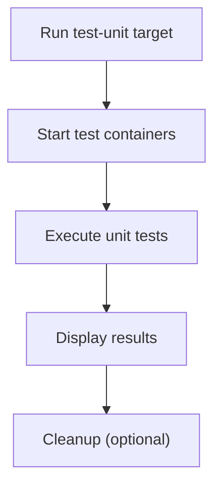

# User Story: test-unit

## Motivation
Unit tests ensure that individual components of the codebase work as intended in isolation. Running unit tests regularly helps catch regressions early and supports confident refactoring.

## Actors
- Developers: Write and run unit tests to verify code changes.
- CI/CD Systems: Automatically execute unit tests on every push or pull request.

## Preconditions
- Docker and Docker Compose are installed and running.
- The test containers are built and available.
- The workspace is at the project root.
- Unit tests are located in the appropriate directory (e.g., `tests/unit/`).

## Step-by-Step Actions
1. Run the unit test suite:
   ```bash
   make -f Makefile.ai-test test-unit
   ```
   Optionally, pass extra pytest arguments:
   ```bash
   make -f Makefile.ai-test test-unit PYTEST_ARGS="-k <pattern>"
   ```
2. The target starts the required test containers (if not already running).
3. Only the unit tests are executed, isolated from integration or end-to-end tests.
4. Results are displayed in the terminal.

### Workflow Diagram


## Expected Outcomes
- All unit tests are executed in a clean, isolated Docker environment.
- Results are displayed, including any failures or errors.
- Developers receive fast feedback on code changes.

## Best Practices
- Write unit tests for all new features and bug fixes.
- Run unit tests before pushing code or opening a pull request.
- Use mocks and stubs to isolate components under test.
- Keep unit tests fast and independent.
- Document any additional test targets or workflows in user stories for discoverability.
- Save unit test output for further analysis:
  ```bash
  make -f Makefile.ai-test test-unit > unit_test_output.txt
  ```
- Troubleshoot common issues such as test failures or import errors by reviewing the output and checking for missing dependencies or incorrect test paths.
