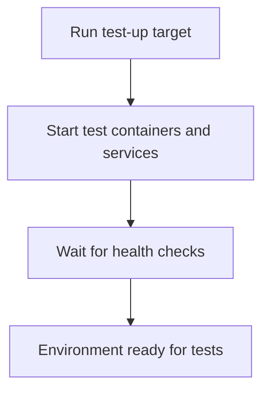

# User Story: test-up

## Motivation
Starting the test containers and services is the first step in preparing the environment for running tests. This ensures all dependencies are available and the system is ready for test execution.

## Actors
- Developers: Start test containers before running tests or debugging issues.
- CI/CD Systems: Bring up the test environment as part of the build pipeline.

## Preconditions
- Docker and Docker Compose are installed and running.
- The workspace is at the project root.

## Step-by-Step Actions
1. Run the test-up target:
   ```bash
   make -f Makefile.ai-test test-up
   ```
2. The target starts all test containers and services defined in `docker-compose.test.yml`.
3. Wait for containers to become healthy and ready.
4. The environment is now ready for running tests.

### Workflow Diagram


## Expected Outcomes
- All required test containers and services are running and healthy.
- The environment is ready for running unit, integration, or other tests.
- Developers and CI/CD systems can proceed with test execution.

## Best Practices
- Run test-up before running any test targets.
- Ensure containers are healthy before starting tests.
- Use test-up as part of your development and CI/CD workflow.
- Document any additional setup steps needed for new services or dependencies.
- Save logs from the startup process for troubleshooting:
  ```bash
  make -f Makefile.ai-test test-up > test_up_logs.txt
  ```
- Troubleshoot common issues such as containers failing to start or health checks not passing by reviewing the logs and Docker status.
