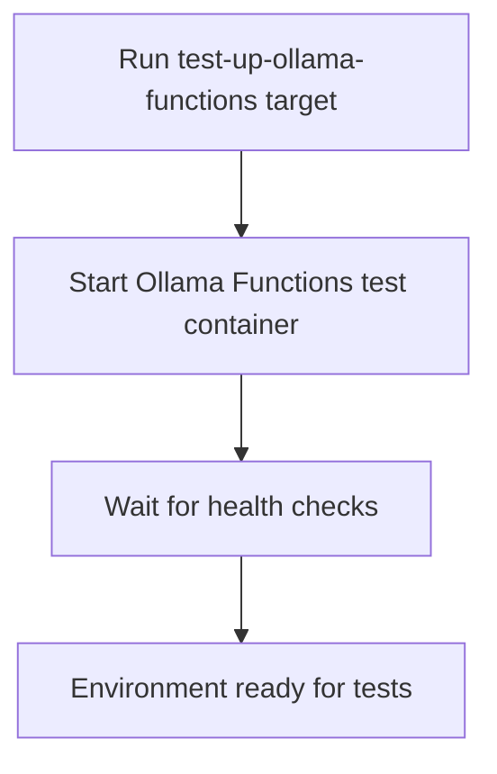

# User Story: test-up-ollama-functions

## Motivation
Starting the Ollama Functions test container is necessary for running tests that depend on this service. The test-up-ollama-functions target standardizes this process for all contributors and CI systems.

## Actors
- Developers: Start the Ollama Functions container before running related tests.
- CI/CD Systems: Bring up the Ollama Functions service as part of the build pipeline.

## Preconditions
- Docker and Docker Compose are installed and running.
- The workspace is at the project root.

## Step-by-Step Actions
1. Run the test-up-ollama-functions target:
   ```bash
   make -f Makefile.ai-test test-up-ollama-functions
   ```
2. The target starts the Ollama Functions test container as defined in `docker-compose.test.yml`.
3. Wait for the container to become healthy and ready.
4. The environment is now ready for running tests that require Ollama Functions.

### Workflow Diagram


## Expected Outcomes
- The Ollama Functions test container is running and healthy.
- The environment is ready for running related tests.
- Developers and CI/CD systems can proceed with test execution.

## Best Practices
- Run test-up-ollama-functions before running any tests that require this service.
- Ensure the container is healthy before starting tests.
- Use this target as part of your development and CI/CD workflow.
- Document any additional setup steps needed for new services or dependencies.
- Save logs from the startup process for troubleshooting:
  ```bash
  make -f Makefile.ai-test test-up-ollama-functions > ollama_up_logs.txt
  ```

## Troubleshooting
- **Container fails to start:** Check the logs for error messages and ensure Docker resources are available.
- **Health checks not passing:** Review the container logs for readiness or dependency issues.
- **Service not available:** Verify the container is running and accessible on the expected network and port.
