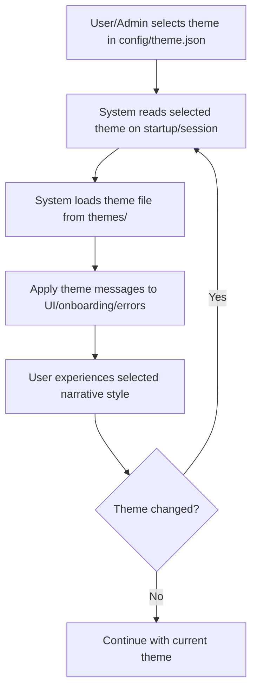

# User Story: Theme Toggle System

## Motivation
To provide users and teams with the ability to switch between different narrative styles (themes) for onboarding, documentation, and system messages. This enhances engagement, supports diverse team cultures, and allows for a customizable user experience.

## Actors
- **User/Operative:** The person interacting with the system who may wish to change the theme.
- **System/Platform:** Loads and applies the selected theme to all relevant messages and UI elements.
- **Theme Designer (Optional):** Team member who creates or updates theme assets.

## Preconditions
- Multiple theme files (e.g., `pirate.json`, `cyberpunk.json`) exist in the `themes/` directory.
- The current theme is specified in `config/theme.json`.
- The system is configured to load and apply theme messages dynamically (e.g., via `utils/theme_loader.py`).

## Step-by-Step Actions
1. **Theme Selection:**
   - User or admin updates `config/theme.json` to set the desired theme (e.g., "cyberpunk").
2. **Theme Loading:**
   - On system startup or user session initiation, the platform reads the current theme from the config file.
3. **Message/Application Update:**
   - The system loads the corresponding theme file from `themes/` and applies its messages to onboarding, errors, achievements, and other UI elements.
4. **User Experience:**
   - The user experiences the system in the selected narrative style (e.g., pirate, cyberpunk).
5. **Theme Switching (Optional):**
   - The user or admin can change the theme at any time by updating the config, and the system will reload the new theme on the next session or immediately if hot-reloading is supported.

## Expected Outcomes
- Users can easily switch between available themes.
- All relevant system messages and onboarding flows reflect the selected theme.
- The system is easily extendable to support new themes in the future.

## Best Practices
- Keep theme files organized and well-documented.
- Ensure all user-facing messages have entries in each theme file.
- Provide a default/fallback theme in case of missing or invalid config.
- Allow for easy addition of new themes by following the established file structure.
- Document the theme toggle system for future maintainers and designers.

## Workflow Diagram

The following Mermaid diagram illustrates the workflow for the theme toggle system:

**Explanation:**
- The user or admin selects a theme by updating the config file.
- The system reads the selected theme on startup or session initiation.
- The corresponding theme file is loaded and applied to all relevant messages and UI elements.
- If the theme is changed, the system reloads the new theme; otherwise, it continues with the current theme.

---

*This user story ensures the theme toggle system is robust, user-friendly, and supports a dynamic, engaging experience for all crew members—no matter the narrative style chosen.* 