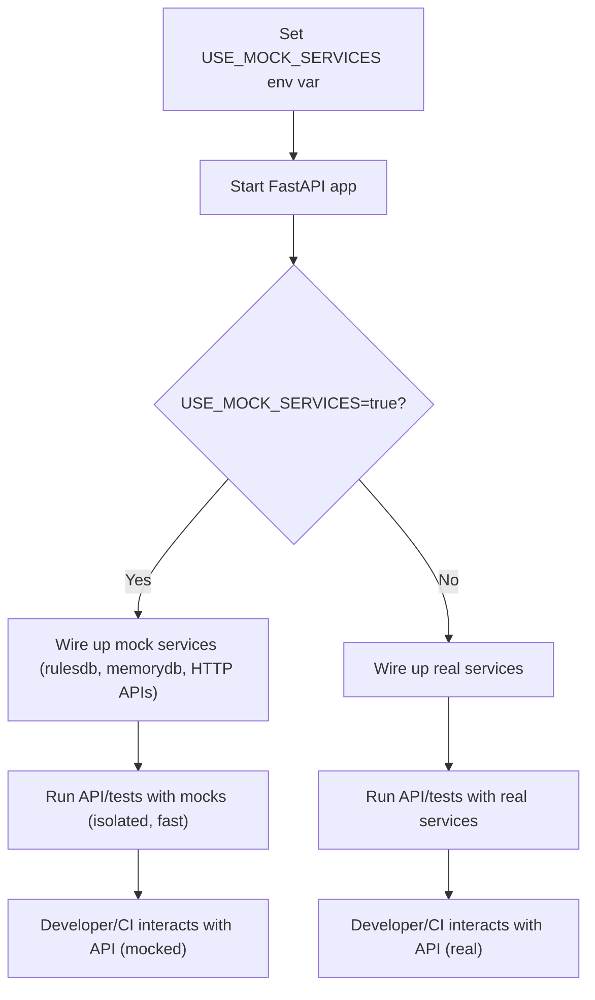

# User Story: Toggleable Mock Services for FastAPI Apps

## Motivation
Developers and testers need to run the API and supporting services in a fully isolated, dependency-free mode for local development, CI, and integration testing. This enables rapid iteration, reliable tests, and easier onboarding.

## Actors
- Developer
- CI/CD system
- Test automation

## Preconditions
- The FastAPI apps (`rule_api_server.py`, `ollama_functions`) are running.
- Environment variable `USE_MOCK_SERVICES` is available.

## Steps
1. Developer (or CI) sets `USE_MOCK_SERVICES=true` before starting the app.
2. On startup, the app checks the environment variable.
3. If `USE_MOCK_SERVICES=true`, the app wires up mock implementations for:
    - `rulesdb` (in-memory or stub)
    - `memorydb` (in-memory or stub)
    - HTTP APIs (returns canned responses)
4. If `USE_MOCK_SERVICES` is not set, the app uses real services.
5. Developer or test suite interacts with the API as usual, but all side effects are isolated and fast.

## Expected Outcomes
- Developers can run the API and tests without needing real databases or external APIs.
- CI can run fast, isolated tests.
- Switching between real and mock services is a one-line config change.
- Onboarding is easier for new contributors.

## Best Practices
- Mock interfaces must match real service interfaces exactly.
- All mocks should be documented and easy to extend.
- Makefile targets should be provided for both modes.

## Workflow Diagram

The following Mermaid diagram illustrates the toggleable mock services workflow:

**Explanation:**
- The developer or CI sets the `USE_MOCK_SERVICES` environment variable before starting the app.
- On startup, the app checks the variable and wires up either mock or real services accordingly.
- The API and tests then run in the selected mode, providing either isolated, fast mocks or full integration with real services. 