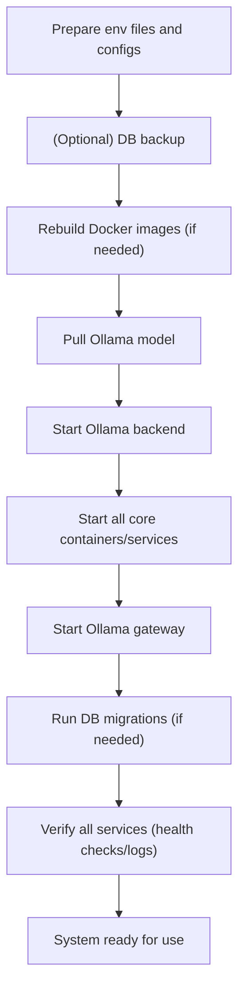

# User Story: Unified System Startup

## Motivation
As a developer, maintainer, or new team member, I want a single, unified workflow to bring the entire system—including core services, Ollama LLM backend, and the Ollama gateway—online after a restart or for onboarding, so that I can reliably get all features running with minimal manual steps.

## Actors
- Developer
- System Operator
- System Administrator
- New Team Member (onboarding)
- CI/CD Pipeline

## Preconditions
- Docker, Docker Compose, and `Makefile.ai` are available.
- Ollama is installed (if running on host) and the required model is available.
- The `ollama-functions` gateway service is defined in `docker-compose.yml`.
- All required Docker Compose files and Makefile targets are present.
- The system is configured with the necessary environment variables (copy from `change-this-env.*.example` as needed).
- Code, dependencies, or models may have changed, or the system is being started after a shutdown.

## Step-by-Step Actions
1. (Optional) Back up database data:
   ```bash
   make -f Makefile.ai ai-db-backup-data-only
   ```
2. Rebuild all Docker images (if code or dependencies changed):
   ```bash
   make -f Makefile.ai ai-rebuild-all
   ```
3. Pull the required Ollama model:
   ```bash
   make -f Makefile.ai ai-ollama-pull-model
   ```
4. Start the Ollama backend (host, in background):
   ```bash
   make -f Makefile.ai ai-ollama-serve-docker-gateway-bg
   ```
5. Start all core services:
   ```bash
   make -f Makefile.ai ai-up
   ```
6. Start the Ollama gateway service:
   ```bash
   make -f Makefile.ai ai-up-ollama-functions
   ```
7. Run database migrations (if needed):
   ```bash
   make -f Makefile.ai ai-db-migrate
   ```
8. Verify all services are running and healthy:
   ```bash
   make -f Makefile.ai ai-status
   ```
9. Wait for health checks or logs to confirm all services are running.
10. Begin development, testing, or onboarding tasks as needed.

## Starting the Test Environment

To start the test environment, the preferred method is:

```bash
make -f Makefile.ai-test test-up
```

This command will bring up all test containers (test-db, test-api, test, test-frontend, test-misc-scripts, test-ollama-functions, test-worker) as defined in `docker-compose.test.yml`.

## Expected Outcomes
- All system and LLM services are started and healthy.
- Developers and new team members can use all features with minimal manual steps.
- The process is consistent and documented for onboarding and recovery.
- Reduced onboarding friction and fewer environment setup errors.

## Best Practices
- Only start the services you need for your workflow.
- Use the correct env file for each service/profile.
- Never mix dev and test settings in the same env file.
- Document new profiles/env files as you add them.
- Always back up data before making changes to Docker Compose files.
- Keep the unified startup command up to date as new services are added.
- Use health checks in Docker Compose to ensure dependencies are ready.
- Document any manual steps required before or after startup.
- Prefer Makefile targets that wrap Docker Compose for consistency.
- Regularly test the startup process in a clean environment.

## Workflow Diagram



---

## Docker Compose Profiles, Environment Management, and Safe Edits

To make onboarding, development, and testing smoother, we use Docker Compose **profiles** and per-service environment files. This allows you to:
- Start only the services you need (e.g., core dev, LLM, test, or worker-only)
- Use the correct environment variables for each service and context
- Avoid accidental misconfiguration or resource waste

### Profiles in Compose
- `dev`: Core API, DB, Redis, etc.
- `llm`: LLM worker, Ollama, and related services
- `test`: Test API, test DB, test Redis, etc.
- `llm-test`: LLM worker in test mode

### Example: Starting Services by Profile
```bash
# Core development
make dev-up
# LLM/AI features
make llm-up
# API testing
make test-up
# LLM worker test mode
make llm-test-up
# Stop all
make down
```

### Environment Management
- Each service/worker has a template env file: `change-this-env.<service>.example`
- Copy and edit these as needed (e.g., `cp change-this-env.llm-worker.example .env.llm-worker`)
- Reference these files in your Compose service definitions using `env_file:`

### Safe Editing: Always Back Up Compose Files
Before making changes to `docker-compose.yml` or `docker-compose.test.yml`, create a timestamped backup:
```bash
cp docker-compose.yml docker-compose.yml.bak.$(date +%Y%m%d-%H%M%S)
cp docker-compose.test.yml docker-compose.test.yml.bak.$(date +%Y%m%d-%H%M%S)
```

### Best Practices
- Only start the services you need for your workflow
- Use the correct env file for each service/profile
- Never mix dev and test settings in the same env file
- Document new profiles/env files as you add them
- Always make a backup before editing Compose files

---

## Expected Outcomes
- All core services, Ollama backend, and gateway are running and healthy.
- The system is ready for LLM-powered features and normal operation.
- The process is standardized, easy to follow, and minimizes manual troubleshooting.

---

## Best Practices
- **Always back up your data before destructive operations if you want to preserve it.**
- Use the no-cache option if you suspect Docker cache issues.
- Check Ollama gateway health before running LLM-dependent features or tests.
- Automate this setup in onboarding scripts or CI/CD pipelines if possible.
- Document any issues or troubleshooting steps for future reference.

---

## Troubleshooting
- If changes are not reflected, try a no-cache rebuild:
  ```bash
  make -f Makefile.ai ai-rebuild-all NOCACHE=1
  ```
- If containers fail to start, check logs and ensure all dependencies are installed.
- For persistent issues, try a full clean:
  ```bash
  docker compose down -v
  make -f Makefile.ai ai-db-backup-data-only
  make -f Makefile.ai ai-rebuild-all NOCACHE=1
  make -f Makefile.ai ai-up
  ```
- If Ollama gateway health check fails, ensure both backend and gateway are running:
  ```bash
  make -f Makefile.ai ai-ollama-serve-docker-gateway-bg
  make -f Makefile.ai ai-up-ollama-functions
  make -f Makefile.ai ai-ollama-functions-health
  ```
- If model not found or outdated, pull or update the model:
  ```bash
  make -f Makefile.ai ai-ollama-pull-model
  ```
- For logs and debugging:
  ```bash
  make -f Makefile.ai ai-ollama-functions-logs
  make -f Makefile.ai ai-ollama-logs
  ```

---

## References
- Makefile.ai targets: `ai-db-backup-data-only`, `ai-rebuild-all`, `ai-up`, `ai-db-migrate`, `ai-status`, `logs-api`, `logs-admin-frontend`, `logs-frontend`, `ai-ollama-pull-model`, `ai-ollama-serve-docker-gateway-bg`, `ai-up-ollama-functions`, `ai-ollama-functions-health`, `ai-ollama-functions-logs`, `ai-ollama-kill`, `ai-restart-ollama-functions`, `ai-ollama-restart-docker-gateway`
- [system_rebuild_and_restart.md](system_rebuild_and_restart.md)
- [ollama_gateway_support.md](ollama_gateway_support.md)
- [llm_onboarding.md](llm_onboarding.md) 