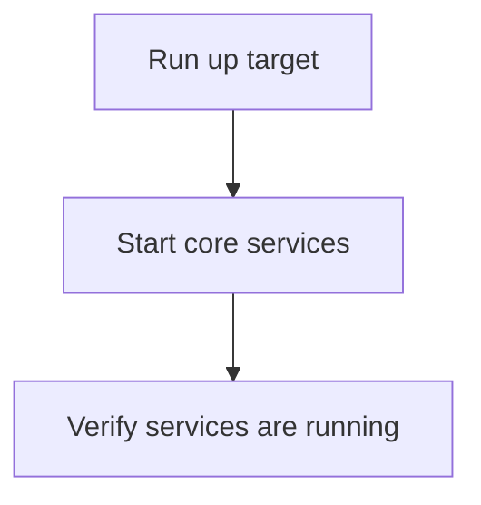

# User Story: up

## Motivation
To provide a simple command for starting all core project services and dependencies, supporting local development and testing.

## Actors
- Developers
- Project maintainers
- QA engineers

## Preconditions
- The project includes an up target in the Makefile or a script for starting services.
- All required services are defined in Docker Compose or equivalent.

## Step-by-Step Actions
1. Run the up target:
   ```bash
   make up
   ```
2. The system starts all core services and dependencies (e.g., database, API, frontend).
3. The user verifies that all services are running.

## Expected Outcomes
- All core services are started and available for development or testing.
- Developers can begin work immediately.

## Best Practices
- Document all services started by up.
- Ensure services are idempotent and can be restarted safely.
- Log service status and output for troubleshooting.

## Workflow Diagram


