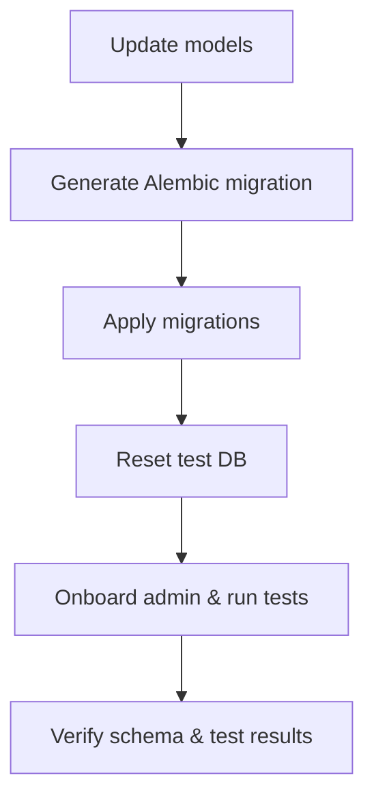

# User Story: Update Models, Generate Migrations, Apply, and Reset DB

## Motivation
As a developer, I want a clear, repeatable workflow for updating database models, generating and applying Alembic migrations, and resetting the test database, so that schema changes are robust, testable, and easy to recover from.

## Actors
- Developer
- System Administrator
- CI/CD pipeline

## Preconditions
- The project uses SQLAlchemy models and Alembic for migrations.
- The database runs in Docker Compose (e.g., `rulesdb`, `memorydb`).
- Makefile targets are available for migration and DB management.

## Docker Postgres Service Names

| Environment | Service Name |
|-------------|--------------|
| Dev/Prod    | db           |
| Test/CI     | test-db      |

> **Note:** All general usage, onboarding, and code samples use `db` as the default Postgres service/container. Use `test-db` only for test/CI environments or when running tests.

## Step-by-Step Actions
1. Update SQLAlchemy models as needed (e.g., change column types, add/remove fields).
2. Generate a new Alembic migration reflecting model changes:
   ```bash
   make -f Makefile.ai-db ai-db-revision MSG="Describe your schema change"
   ```
3. Apply all migrations to the database:
   ```bash
   make -f Makefile.ai-db ai-db-migrate
   ```
4. Reset and set up the test database using the Makefile target:
   ```bash
   make -f Makefile.ai ai-test-clean
   ```
5. (Preferred) Set up the database, onboard admin, and run tests:
   ```bash
   make -f Makefile.ai ai-test-with-setup
   ```
6. If needed, use the provided Makefile targets to check current migration status or recover from errors.

## Expected Outcomes
- Database schema changes are robust, testable, and easy to recover from.
- The test database is always in sync with the latest models and migrations.
- Developers can confidently update models and migrations without downtime.

## Best Practices
- Always use Makefile targets for migration and DB management.
- Run tests after applying migrations to verify schema changes.
- Document any manual steps or custom SQL in migration scripts.
- Onboard admin and run tests after resetting the database.

## Workflow Diagram



## Warnings
- If you need to change a `vector(768)` column (pgvector), do not rely on Alembic's autogenerate. Write manual SQL in your migration, and be aware that autogenerate may not detect or handle these types correctly.

## References
- [Safe Schema Migrations](./safe_schema_migrations.md)
- [Database Migration Recovery & Stamping](./db_migration_recovery_and_stamping.md)
- [Checking and Applying Database Migrations](./database_migrations.md)
- **After nuking or resetting the database, always run onboarding (`make -f Makefile.ai ai-onboard-admin`) before running tests if not using `ai-test-with-setup`.** 