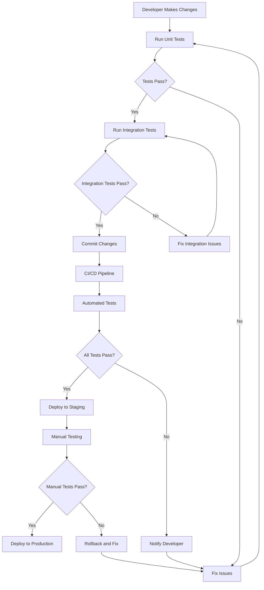

# User Story: Worker Testing Workflow

## Motivation
As the memory system grows with multiple workers handling different aspects (enrichment, similarity pruning, progress reporting), we need comprehensive testing to ensure reliability, catch regressions, and maintain code quality. Unit tests provide fast feedback during development and help document expected behavior.

---

## Actors
- **Developers:** Write, run, and maintain worker tests; use tests to verify changes
- **CI/CD Pipeline:** Automatically runs tests on code changes
- **QA Team:** Uses tests to validate worker functionality
- **System Administrators:** Runs tests to verify worker health after deployments

---

## Preconditions
- Test environment is set up and running
- Worker code is available in the codebase
- Test dependencies are installed
- Docker containers are running for test execution

---

## Workflow

### 1. **Test Environment Setup**
```bash
# Start test environment
make -f Makefile.ai test-up

# Verify test environment is ready
make -f Makefile.ai test-quickstart
```

### 2. **Running Individual Worker Tests**

#### **Memory Enrichment Worker Tests**
```bash
# Run enrichment worker unit tests
make -f Makefile.ai test-memory-enrichment-worker

# Tests cover:
# - LLM-based tag and category extraction
# - Keyword extraction fallback
# - Edge creation (tag-based and content reference)
# - Batch processing and error handling
# - Job configuration validation
```

#### **Memory Similarity Pruning Worker Tests**
```bash
# Run similarity pruning worker unit tests
make -f Makefile.ai test-memory-similarity-worker

# Tests cover:
# - Similarity group creation and management
# - Vector, content, and tag similarity calculations
# - Group processing (merge vs link decisions)
# - Threshold-based filtering
# - Database error handling
```

#### **Progress Report Worker Tests**
```bash
# Run progress report worker unit tests
make -f Makefile.ai test-progress-report-worker

# Tests cover:
# - Memory statistics collection
# - Rule statistics collection
# - Worker health monitoring
# - System metrics collection
# - Report formatting and generation
# - Health score calculation
```

### 3. **Running All Worker Tests**
```bash
# Run all worker unit tests together
make -f Makefile.ai test-all-workers

# Run complete memory system tests (workers + integration)
make -f Makefile.ai test-memory-system
```

### 4. **Test Development Workflow**

#### **Adding New Tests**
```python
# Example: Adding test for new enrichment feature
def test_new_enrichment_feature():
    """Test new enrichment functionality."""
    # Arrange
    test_node = make_memory_node("test1", "test", "content")
    
    # Act
    result = new_enrichment_function(test_node)
    
    # Assert
    assert result["status"] == "success"
    assert "expected_field" in result
```

#### **Running Tests During Development**
```bash
# Run specific test file
make -f Makefile.ai test-one TEST_FILE=tests/unit/test_memory_enrichment_worker.py

# Run specific test function
docker compose exec test-api python -m pytest tests/unit/test_memory_enrichment_worker.py::TestEnrichmentWorkflow::test_process_enrichment_job_dry_run -v

# Run tests with coverage
make -f Makefile.ai test-coverage
```

### 5. **Test Categories and Coverage**

#### **Unit Tests** (`tests/unit/`)
- **Memory Enrichment Worker** (`test_memory_enrichment_worker.py`)
  - LLM integration and fallback mechanisms
  - Tag and category extraction
  - Edge creation algorithms
  - Batch processing logic
  - Error handling and retry logic

- **Memory Similarity Pruning Worker** (`test_memory_similarity_pruning_worker.py`)
  - Similarity calculation functions
  - Group management and processing
  - Threshold-based filtering
  - Database operations
  - Merge vs link decision logic

- **Progress Report Worker** (`test_progress_report_worker.py`)
  - Statistics collection from multiple sources
  - Health monitoring and scoring
  - Report formatting
  - System metrics integration
  - Error handling for external services

#### **Integration Tests** (`tests/integration/`)
- **Memory Endpoints** (`test_memory_endpoints.py`)
  - API endpoint functionality
  - Database integration
  - Worker interaction

- **Embedding Integration** (`test_embedding_integration.py`)
  - Vector operations
  - Similarity calculations
  - Database storage

### 6. **Test Data and Fixtures**

#### **Common Test Fixtures** (`tests/unit/conftest.py`)
```python
@pytest.fixture
def sample_memory_nodes():
    """Sample memory nodes for testing."""
    return [
        make_memory_node("node1", "test", "content1"),
        make_memory_node("node2", "test", "content2")
    ]

@pytest.fixture
def enrichment_job_config():
    """Sample enrichment job configuration."""
    return {
        "scope": "all",
        "dry_run": True,
        "create_edges": True
    }
```

#### **Mock Services**
- Database sessions and queries
- LLM API calls
- External service health checks
- System metrics collection

### 7. **Test Best Practices**

#### **Test Structure**
```python
class TestFeatureName:
    """Test group for specific feature."""
    
    def test_specific_scenario(self):
        """Test specific scenario with descriptive name."""
        # Arrange - Set up test data
        # Act - Execute function under test
        # Assert - Verify expected outcomes
```

#### **Async Testing**
```python
@pytest.mark.asyncio
async def test_async_function():
    """Test async functions properly."""
    result = await async_function()
    assert result["status"] == "success"
```

#### **Error Handling**
```python
def test_error_scenario():
    """Test error handling scenarios."""
    with pytest.raises(ExpectedException):
        function_that_should_fail()
```

### 8. **Continuous Integration**

#### **Automated Testing**
- Tests run on every pull request
- Coverage reports generated
- Test results reported to team
- Failed tests block merges

#### **Test Environment**
```yaml
# docker-compose.test.yml
services:
  test-api:
    environment:
      - ENVIRONMENT=test
      - POSTGRES_HOST=db-test
      - REDIS_HOST=redis-test
```

---

## Expected Outcomes

### **Immediate Results**
- ✅ Fast feedback on code changes
- ✅ Detection of regressions
- ✅ Documentation of expected behavior
- ✅ Confidence in refactoring

### **Long-term Benefits**
- ✅ Improved code quality and reliability
- ✅ Easier onboarding for new developers
- ✅ Reduced debugging time
- ✅ Better system stability

### **Quality Metrics**
- **Test Coverage:** >80% for worker functions
- **Test Execution Time:** <30 seconds for unit tests
- **Test Reliability:** <1% flaky tests
- **Documentation:** All public functions have tests

---

## Common Pitfalls

### **Test Data Management**
- ❌ **Problem:** Tests depend on shared database state
- ✅ **Solution:** Use isolated test data and cleanup

### **Async Testing**
- ❌ **Problem:** Forgetting to mark async tests properly
- ✅ **Solution:** Always use `@pytest.mark.asyncio` for async tests

### **Mock Complexity**
- ❌ **Problem:** Over-mocking making tests brittle
- ✅ **Solution:** Mock only external dependencies

### **Test Isolation**
- ❌ **Problem:** Tests affecting each other
- ✅ **Solution:** Use fresh fixtures and proper cleanup

---

## Troubleshooting

### **Test Failures**
```bash
# Check test environment
make -f Makefile.ai test-quickstart

# Run tests with verbose output
make -f Makefile.ai test-memory-enrichment-worker

# Check test logs
docker compose logs test-api | grep -i "test"
```

### **Environment Issues**
```bash
# Rebuild test environment
make -f Makefile.ai test-rebuild

# Reset test database
make -f Makefile.ai test-db-nuke
```

### **Performance Issues**
```bash
# Run tests in parallel
docker compose exec test-api python -m pytest -n auto

# Profile slow tests
docker compose exec test-api python -m pytest --durations=10
```

---

## Related Documentation
- [Testing Workflow](onboarding/TESTING_WORKFLOW.md) - General testing guidelines
- [Memory System](onboarding/MEMORY_SYSTEM.md) - Memory system architecture
- [Worker Architecture](docs/architecture.md) - Worker system design
- [Database Testing](onboarding/DB_MIGRATIONS.md) - Database testing patterns

---

## Mermaid Workflow Diagram



---

*This user story ensures that all memory workers are thoroughly tested, providing confidence in the system's reliability and making it easier to maintain and extend the codebase.* 